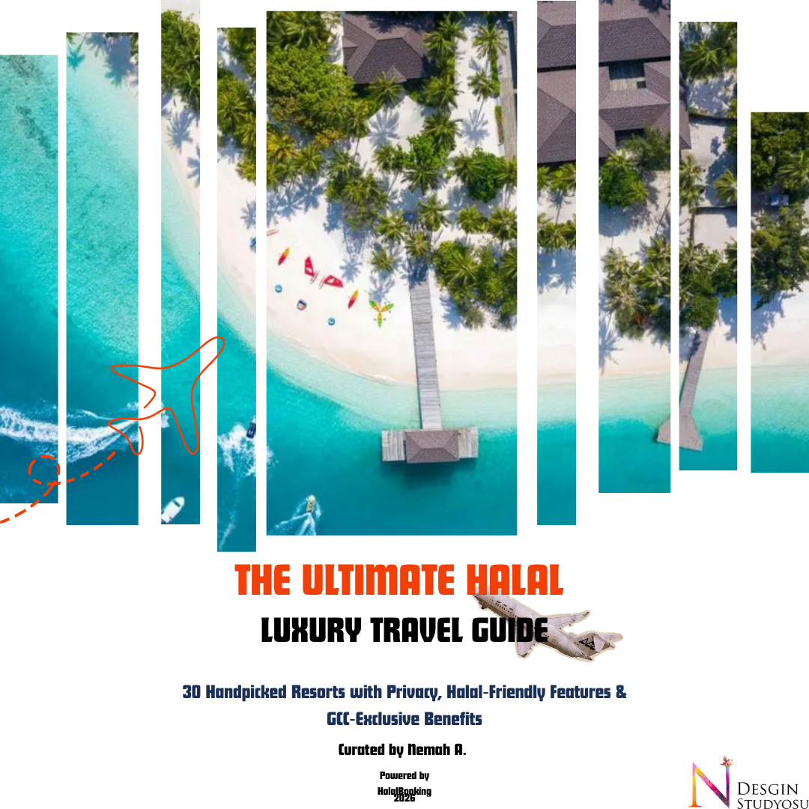
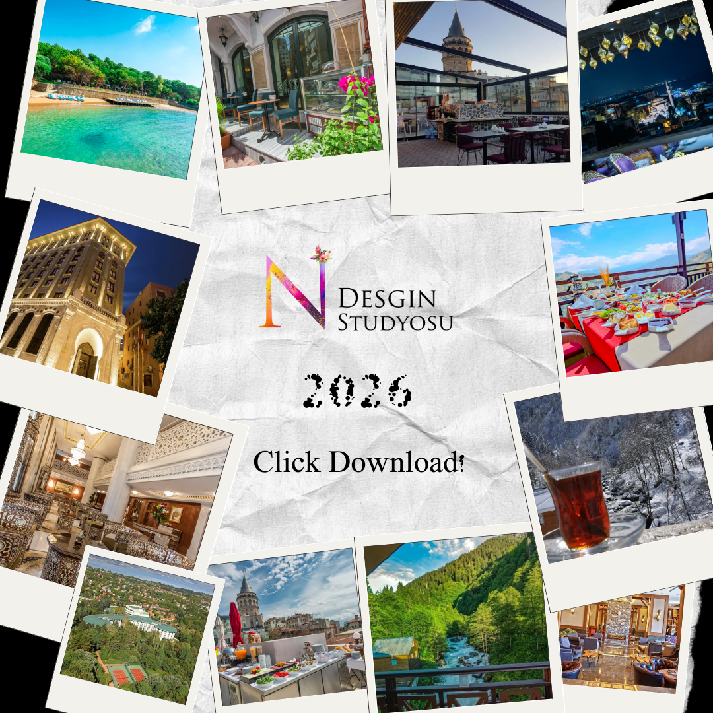
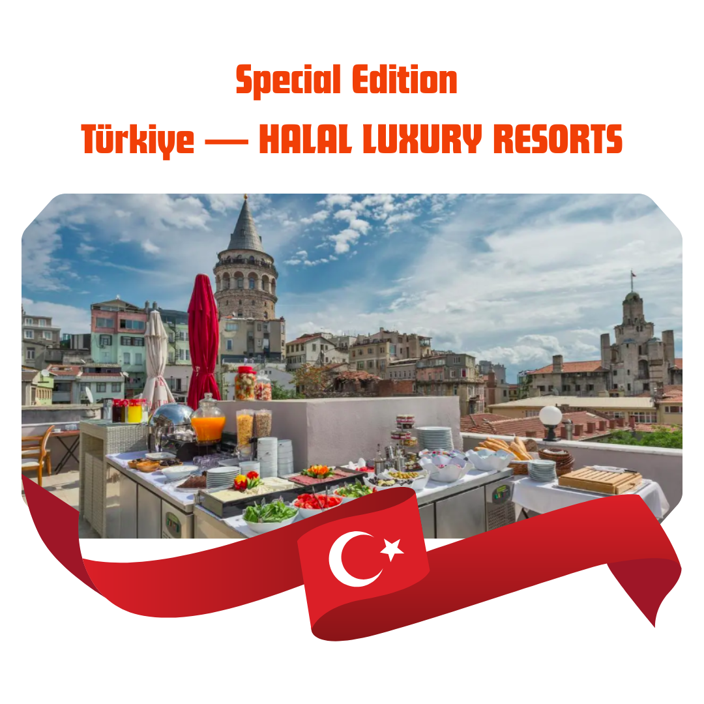
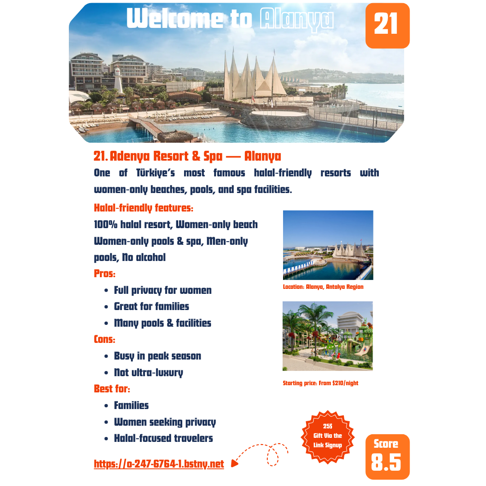
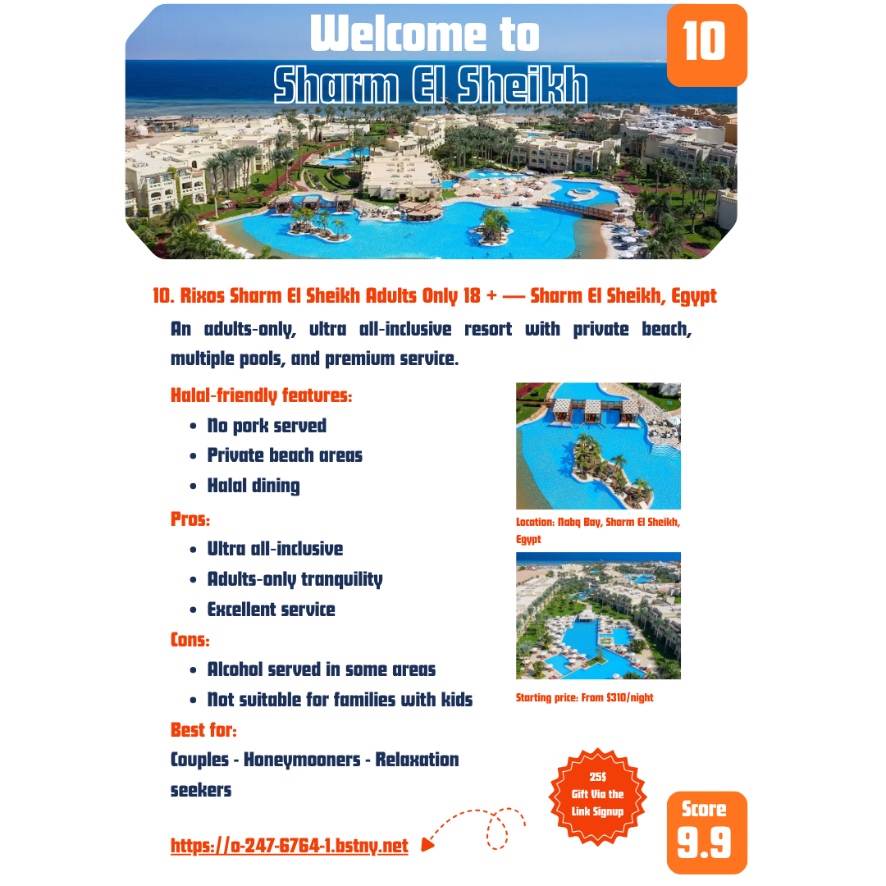

  The Ultimate Halal Luxury Travel Guide

  
    30 Resorts • Private Pools • Women‑Only Facilities • GCC Exclusive Benefits
  

---

# 🌍 A New Era of Halal Luxury Travel  
*Where privacy meets elegance — and every detail respects your values.*

  

---

<h2 style="margin-top:0;">Free PDF for GCC Travelers</h2>

A beautifully designed, 40‑page luxury travel guide featuring <strong>30 handpicked halal‑friendly resorts</strong> across the Maldives, Türkiye, UAE, Qatar, Oman, Morocco, Malaysia, Zanzibar, Bosnia, and Georgia.  
Curated with love, precision, and a deep understanding of what halal‑conscious luxury travelers truly need.

<a href="https://drive.google.com/uc?export=download&id=1BusZwe0CzxbQgfMEuGpJfOJ-PP1lTIAM"
   onclick="gtag('event', 'Download_PDF', { event_category: 'PDF', event_label: 'Halal Luxury Travel Guide' });"
   class="cta-button">
   📥 Download the Halal Luxury Travel Guide (Free PDF)
</a>

---

# 🕌 Why This Guide Matters  
Eid Al‑Adha is approaching — one of the most important travel seasons for Muslim families.  
Yet **finding verified halal‑friendly luxury resorts remains a challenge**.

This guide solves that with:

- ✔ **Private pool villas**  
- ✔ **Women‑only beaches & spa facilities**  
- ✔ **Halal dining**  
- ✔ **Alcohol‑free options**  
- ✔ **Family privacy**  
- ✔ **GCC‑exclusive benefits**  

  

---

# What’s Inside the Guide

## **1. 30 Luxury Halal‑Friendly Resorts**
Across 12 breathtaking destinations:

- Maldives  
- Türkiye  
- UAE  
- Qatar  
- Oman  
- Morocco  
- Malaysia  
- Zanzibar  
- Bosnia  
- Georgia  

Each resort includes:

- Halal‑friendly features  
- Pros & cons  
- Best‑for categories  
- Starting prices  
- Map pins  
- Affiliate booking link  
- GCC discount reminder  

---

## **2. Exclusive Türkiye Section (10 Resorts)**  
Women‑only beaches, private coves, forest retreats, and Ottoman‑style luxury — curated for GCC travelers.

  

---

## **3. GCC‑Exclusive Benefit**  
You receive:

- **$25 wallet credit**  
- **Valid for bookings above $500**  
- **Valid only for GCC travelers**  
- **No promo code needed**  
- **Automatically applied after registration**  
- **Special Discount “My Affiliate Link” is a Gift inside the PDF**  

---

# A Glimpse Inside the PDF  

  

  

---

# 🌟 Who This Guide Is For

### **For Couples**
Private pools, romantic escapes, Maldives villas, Türkiye coves.

### **For Families**
Large suites, kids' clubs, family‑friendly beaches.

### **For Women Travelers**
Women‑only beaches, women‑only spa times, privacy‑focused resorts.

### **For Luxury Seekers**
Ultra‑premium riads, desert palaces, overwater villas.

---

# 📥 Download the Guide  
Your next halal‑friendly luxury escape starts here.

<a href="https://drive.google.com/uc?export=download&id=1BusZwe0CzxbQgfMEuGpJfOJ-PP1lTIAM"
   onclick="gtag('event', 'Download_PDF', { event_category: 'PDF', event_label: 'Halal Luxury Travel Guide' });"
   class="cta-button">
   📥 Download the Halal Luxury Travel Guide (Free PDF)
</a>

---

# 💛 Travel Well. Travel Halal. Travel Beautifully.  
*Your journey begins with one click — and ends with unforgettable memories.*
