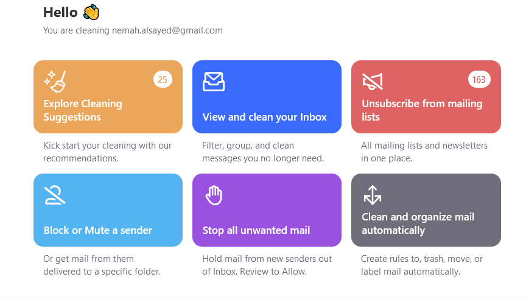
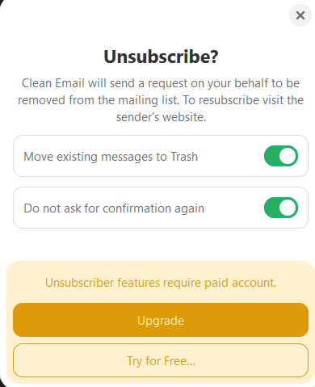

: Clean Email هو أداة إدارة البريد الإلكتروني القوية التي تهدف إلى مساعدة المستخدمين في تنظيم وتنظيف صندوق الوارد الخاص بهم بكفاءة. بفضل مجموعة ميزاته القوية، يتيح للمستخدمين Clean Email فرز الآلاف من رسائل البريد الإلكتروني القديمة وحذفها بسرعة، وإلغاء الاشتراك من النشرات الإخبارية غير المرغوب فيها، وتوفير الوقت من خلال تنفيذ المهام الروتينية في البريد الإلكتروني بشكل تلقائي. يعمل Clean Email على الحفاظ على صندوق الوارد نظيفًا ومنظمًا، ويوفر تجربة سلسة وسهلة الاستخدام للمستخدمين.

الميزات الرئيسية: ١. فرز وحذف البريد الإلكتروني: توفر Clean Email خيارات تصفية متقدمة تسمح للمستخدمين بفرز رسائل البريد الإلكتروني حسب معايير مختلفة مثل التاريخ والمرسل والحجم. يسهل ذلك تحديد وحذف دفعات كبيرة من رسائل البريد الإلكتروني غير الضرورية، مما يوفر مساحة تخزين قيمة ويقلل من الفوضى.

٢. إلغاء الاشتراك من النشرات الإخبارية: تساعد ميزة إلغاء الاشتراك المستخدمين على الانسحاب بسهولة من النشرات الإخبارية ورسائل البريد الإلكتروني الترويجية غير المرغوب فيها. ببضع نقرات فقط، يمكن للمستخدمين تقليل حجم الرسائل الواردة بشكل كبير، مما يسهل التركيز على الرسائل المهمة.

٣. إدارة البريد الإلكتروني التلقائية: تتيح أدوات التحكم التلقائي في Clean Email للمستخدمين إعداد قواعد للتعامل مع رسائل البريد الإلكتروني الواردة. على سبيل المثال، يمكن للمستخدمين إنشاء قواعد لأرشفة الرسائل تلقائيًا أو نقلها أو حذفها استنادًا إلى معايير محددة. توفر هذه الميزة الوقت وتضمن أن يظل صندوق الوارد منظمًا دون الحاجة إلى تدخل يدوي مستمر.

٤. عرض ذكي: تقوم ميزة العرض الذكي بتجميع رسائل البريد الإلكتروني المماثلة معًا، مثل إشعارات وسائل التواصل الاجتماعي وإيصالات التسوق عبر الإنترنت وجداول السفر. تساعد هذه التصنيفات المستخدمين على العثور بسرعة على الرسائل ذات الصلة وإدارتها بشكل فعال.

٥. الخصوصية والأمان: تعتبر Clean Email الخصوصية والأمان أمرين أساسيين. لا تبيع الخدمة بيانات المستخدم وتستخدم طرق تشفير قوية لحماية محتوى البريد الإلكتروني.

الأسعار: تقدم Clean Email مجموعة متنوعة من خطط التسعير لتلبية احتياجات المستخدمين المختلفة:

١. الخطة المجانية: توفر الخطة المجانية ميزات أساسية مع عدد محدود من الإجراءات في الشهر. إنها نقطة انطلاق جيدة للمستخدمين الذين يرغبون في تجربة الخدمة قبل الاشتراك في خطة مدفوعة.

٢. الخطة المميزة:

- الاشتراك الشهري: 9.99 دولارًا شهريًا

- الاشتراك السنوي: 29.99 دولارًا سنويًا (يعادل 2.50 دولارًا شهريًا) تتضمن الخطة المميزة وصولًا غير محدود إلى جميع الميزات، بما في ذلك التصفية المتقدمة وإلغاء الاشتراك غير المحدود وقدرات التحكم التلقائي الكاملة. تعد هذه الخطة مثالية للمستخدمين ذوي حجم عالٍ من رسائل البريد الإلكتروني أو أولئك الذين يحتاجون إلى أدوات إدارة البريد الإلكتروني الشاملة.

٣. خطة الفريق: تختلف أسعار خطط الفرق بناءً على عدد المستخدمين والمتطلبات المحددة. تم تصميم هذه الخطة للشركات والمؤسسات التي تحتاج إلى إدارة عدة حسابات بريد إلكتروني بكفاءة.

الإيجابيات والسلبيات: الإيجابيات:

- واجهة سهلة الاستخدام: يجعل التصميم البديهي لـ Clean Email من السهل على المستخدمين من جميع المستويات التقنية التنقل واستخدام ميزاته.

- توفير الوقت من خلال التحكم التلقائي: يقلل القدرة على تنفيذ المهام الروتينية بشكل تلقائي من الوقت المستغرق في إدارة البريد الإلكتروني.

- إلغاء الاشتراك الفعال: تعد أداة إلغاء الاشتراك فعالة للغاية في تقليل الرسائل غير المرغوب فيها.

- خطة سنوية بأسعار معقولة: توفر الاشتراك السنوي قيمة ممتازة مقابل المال.

السلبيات:

- الخطة المجانية محدودة: قد لا تكون الخطة المجانية كافية للمستخدمين الذين لديهم احتياجات واسعة في إدارة البريد الإلكتروني.

- تكلفة الاشتراك الشهري: يعتبر الاشتراك الشهري مكلفًا نسبيًا مقارنة بالخطة السنوية.

طريقة الاستعمال:

قم أولاً بتسجيل الدخول باستخدام بريدك الإلكتروني، وقد يستغرق الأمر بضع دقائق:

هذه هي لوحة معلومات الأداة:

لنجرب خيار "إلغاء الاشتراك من قوائم البريد":

هذه هي قوائم البريد الموجودة في حسابي والتي أرسلت لي رسالة مؤخرًا:

عندما تنقر فوق "إلغاء الاشتراك"، ستتلقى هذا الإشعار، والذي سيمنحك خيار حذف رسائل هذا المرسل أيضًا.

نظرًا لأنه خيار إصدار مميز، تابع بالنقر فوق خيار "بدء الإصدار التجريبي المجاني" ويمكنك الآن استخدامه في الإصدار التجريبي.

الاستنتاج:

يعد Clean Email أداة قوية وفعالة لإدارة وتنظيم صناديق البريد الإلكتروني. تتضمن ميزاته الشاملة مثل التصفية المتقدمة وإلغاء الاشتراك والتحكم التلقائي، مما يجعله موردًا لا غنى عنه للأفراد والشركات على حد سواء. في حين توفر الخطة المجانية لمحة عن إمكانياتها، توفر الخطط المميزة وخطط الفرق وصولًا كاملاً إلى ميزاتها القوية، مما يجعلها استثمارًا جديرًا لأولئك الذين يسعون للحفاظ على صندوق الوارد نظيفًا ومنظمًا

يمكنكم تجريبه من خلال الرابط الخاص بي: [https://cleanemailr.pxf.io/NDesignStudio](https://cleanemailr.pxf.io/NDesignStudio)
