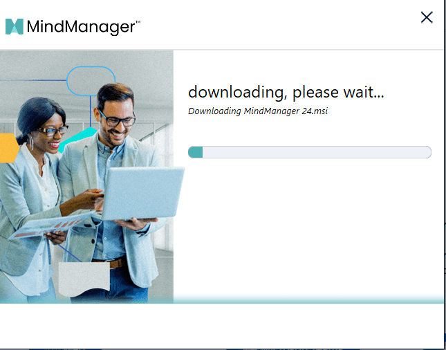

قم بترقية فريقك باستخدام المخططات المرئية الديناميكية والخرائط الذهنية ومخططات التدفق، بالإضافة إلى إمكانات مخطط جانت المحسّنة وتطبيقات MindManager الجديدة. في منشور اليوم، سأقدم عرضًا توضيحيًا لتطبيقاتهم.

برنامجهم يدعم الكتابة باللغة العربية

توجه أولاً إلى https://mindmanager.sjv.io/NDesignStudio

ثم انقر فوق "جربه مجانًا":

ستظهر بعد ذلك نافذة منبثقة حتى تتمكن من تنزيل النسخة التجريبية للبرنامج.

ثم لبدء تجربتك المجانية، تحتاج إلى التسجيل باستخدام بريدك الإلكتروني:

بعد ذلك، سيكون لديك فترة تجريبية لمدة 30 يومًا لاستخدام التطبيق، أو يمكنك استخدامه عبر الإنترنت.

لنبدأ بإنشاء وظائف الخريطة الذهنية والمثال:

في هذا المثال، تريد سالي إنشاء كشك لبيع عصير الليمون؛ وقد استخدمت الخطوات التالية لإنشاء خريطتها:

بدأت ببناء مركز الخريطة: للقيام بذلك، حددت "الموضوع المركزي"، وكتبت ثم نقرت على Enter عند الانتهاء.

وسعت الخريطة بإضافة أفكار، وذلك بالنقر على "+" أو Ctrl+Enter.

لقد حافظت على الخريطة موجزة ومرتبة.

لقد استخدمت مساعدة بصرية ممتعة وإبداعية، وذلك بإدراج الصور.

لقد استخدمت علامة التبويب "التصميم" لتغيير الخط والأنماط ولوحة الألوان.

إليك نظرة عن قرب على إحدى أفكارها:

يوفر التطبيق مجموعة من الأمثلة والوظائف عبر الإنترنت حتى تتمكن من البدء في استخدامه بسهولة. إذا كنت تريد مني تقديم أمثلة حول المزيد من الوظائف، فأضف إعجابك وعلق. يمكنك التحقق من ذلك عبر الرابط الخاص بي: [https://mindmanager.sjv.io/NDesignStudio](https://mindmanager.sjv.io/NDesignStudio)

* * *

رسم خرائط سعيد!
