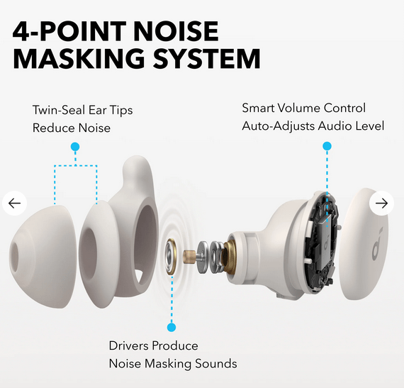

في عالم تكنولوجيا الصوت المتطور باستمرار، برزت Soundcore كلاعب بارز، حيث تقدم مجموعة متنوعة من المنتجات التي تلبي احتياجات المستمعين العاديين وعشاق الصوت. وباعتبارها علامة تجارية تابعة لشركة Anker Innovations، قدمت Soundcore باستمرار أجهزة صوتية عالية الجودة تجمع بين التكنولوجيا المتطورة والميزات سهلة الاستخدام. تتعمق هذه المراجعة في الجوانب المختلفة لعروض Soundcore، وتسلط الضوء على نقاط قوتها ومجالات التحسين.

## مجموعة المنتجات والتنوع

تتميز مجموعة منتجات Soundcore بتنوعها المذهل، حيث تشمل سماعات الأذن اللاسلكية وسماعات الرأس فوق الأذن ومكبرات الصوت المحمولة وأنظمة الصوت المنزلية. يضمن هذا التنوع وجود شيء يناسب الجميع، سواء كنت تبحث عن سماعات أذن صغيرة الحجم للتنقل اليومي أو مكبر صوت قوي لحفلتك القادمة. تشمل المنتجات البارزة سلسلة سماعات الأذن Soundcore Liberty، المعروفة براحتها وجودة الصوت، وسلسلة مكبرات الصوت Soundcore Motion، التي توفر صوتًا قويًا في عبوة محمولة.

## جودة الصوت

تتمثل إحدى السمات البارزة لمنتجات Soundcore في جودة الصوت الاستثنائية. وقد استثمرت العلامة التجارية بشكل كبير في البحث والتطوير لضمان تقديم أجهزتها الصوتية صوتًا واضحًا ومتوازنًا عبر مختلف الأنواع. يتيح استخدام التقنيات المتقدمة مثل BassUp وHearID للمستخدمين تجربة صوت جهير عميق وملامح صوتية مخصصة، مما يعزز تجربة الاستماع الشاملة. سواء كنت تستمع إلى موسيقى كلاسيكية أو مسارات ذات جهير ثقيل، توفر أجهزة Soundcore تجربة صوتية غنية وغامرة.

## التصميم والراحة

تم تصميم منتجات Soundcore مع وضع كل من الجماليات وبيئة العمل في الاعتبار. التصميم الأنيق والحديث لسماعات الرأس وسماعات الأذن يجعلها جذابة بصريًا، في حين يضمن الوزن الخفيف والملاءمة المريحة إمكانية الارتداء لفترة طويلة. إن استخدام مواد عالية الجودة لا يعزز المتانة فحسب، بل يضيف أيضًا شعورًا متميزًا للمنتجات. على سبيل المثال، تم الإشادة بسماعات الرأس من سلسلة Soundcore Life لوسائد الأذن المريحة وعصابات الرأس القابلة للتعديل، مما يجعلها مثالية لجلسات الاستماع الطويلة.

## الميزات المبتكرة

يعد الابتكار جوهر فلسفة Soundcore. تأتي العديد من منتجاتها مزودة بميزات مثل إلغاء الضوضاء النشط (ANC) ووضع الشفافية وإعدادات EQ القابلة للتخصيص. تعمل تقنية إلغاء الضوضاء النشط على تقليل الضوضاء المحيطة بشكل فعال، مما يسمح للمستخدمين بالتركيز على الموسيقى أو المكالمات دون تشتيت الانتباه. بالإضافة إلى ذلك، يضيف دمج المساعدين الأذكياء وعناصر التحكم باللمس في بعض الموديلات طبقة من الراحة، مما يسهل على المستخدمين إدارة تجربة الصوت الخاصة بهم.

## عمر البطارية والاتصال

تشتهر أجهزة Soundcore بعمر البطارية المذهل، والذي يتفوق غالبًا على المنافسين في نفس النطاق السعري. على سبيل المثال، توفر سماعات Soundcore Liberty Air 2 Pro ما يصل إلى 7 ساعات من وقت التشغيل بشحنة واحدة، مع توفير علبة الشحن لساعات إضافية من الاستخدام. يعد الاتصال أيضًا نقطة قوة، حيث تدعم معظم المنتجات تقنية Bluetooth 5.0 أو أعلى، مما يضمن اتصالات مستقرة وسريعة مع الحد الأدنى من زمن الوصول.

## التسعير والقيمة مقابل المال

تحقق Soundcore التوازن بين القدرة على تحمل التكاليف والجودة، مما يجعل منتجاتها في متناول جمهور واسع. في حين أنها قد لا تكون الخيار الأرخص في السوق، فإن القيمة مقابل المال واضحة في جودة التصنيع والأداء الصوتي ومجموعة الميزات الخاصة بأجهزتها. تعمل العروض الترويجية والخصومات المتكررة على تعزيز الجاذبية، مما يسمح للمستهلكين بالاستمتاع بتجارب صوتية متميزة دون إهدار المال.

## دعم العملاء والضمان

تلتزم Soundcore بإرضاء العملاء، وتقدم دعمًا موثوقًا للعملاء وضمانات شاملة لمنتجاتها. يتوفر فريق الدعم المتجاوب للمساعدة في أي مشكلات أو استفسارات، مما يضمن تجربة سلسة وخالية من المتاعب للمستخدمين. كما أن سياسات الضمان تنافسية، مما يوفر راحة البال للمستهلكين الذين يستثمرون في منتجات Soundcore.

## أفضل اختياراتي المعروضة للبيع

* * *

يمكنك التحقق من مجموعة متنوعة من العناصر المخفضة الأخرى عبر الرابط الخاص بي: [https://soundcore.sjv.io/NDesignstudio](https://soundcore.sjv.io/NDesignstudio)

## الخلاصة

في الختام، أثبتت Soundcore نفسها كعلامة تجارية هائلة في مجال تكنولوجيا الصوت، حيث تقدم مزيجًا مقنعًا من الجودة والابتكار والقيمة. سواء كنت مستمعًا عاديًا أو من محبي الصوت المتفانين، فمن المؤكد أن مجموعة منتجات Soundcore ستلبي احتياجاتك الصوتية بأسلوب ومضمون. مع التطورات المستمرة والالتزام بالتميز، أصبحت Soundcore على استعداد للبقاء رائدة في الصناعة لسنوات قادمة
