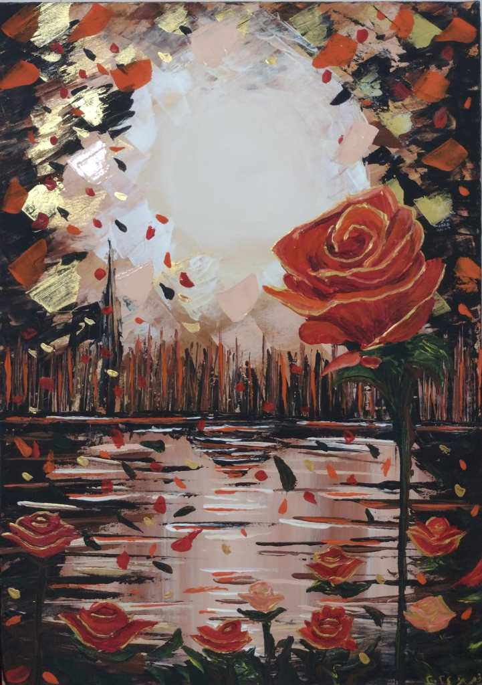
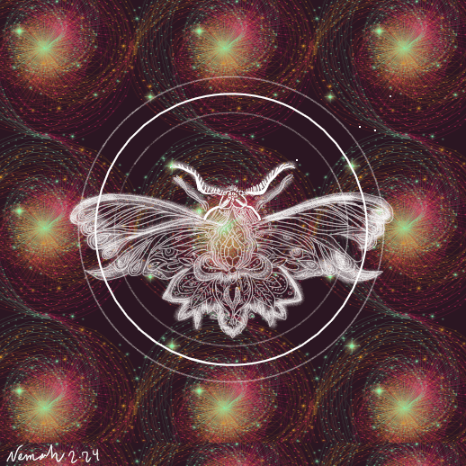

في عصرنا الرقمي الحالي، تتغير الطريقة التي ندرك بها الملكية والإبداع بسرعة كبيرة. واحدة من أبرز التحولات التكنولوجية التي ظهرت هي **الرموز غير القابلة للاستبدال (NFT)**، التي أحدثت ثورة في طريقة تقييم الأصول الرقمية وتداولها.

## **ما هي الـ NFT؟**

الـ NFT (Non-Fungible Tokens) هي أصول رقمية فريدة تمثل ملكية عنصر رقمي أو مادي مثل الفنون، الموسيقى، الألعاب، المقتنيات، أو حتى العقارات الافتراضية. بفضل تقنية **البلوك تشين**، يمكن إثبات ملكية هذه الأصول بشكل آمن وشفاف، مما يمنحها قيمة فريدة لا يمكن تكرارها أو تزويرها.

على عكس العملات المشفرة مثل البيتكوين أو الإيثيريوم، التي يمكن استبدالها بسهولة بقيمة مكافئة، فإن الـ NFT تمثل شيئًا واحدًا فقط، مما يجعلها فريدة من نوعها.

* * *

## **لماذا تحظى الـ NFT بشعبية كبيرة؟**

### **1\. تمكين الفنانين والمبدعين:**

الـ NFT فتحت الأبواب أمام الفنانين والمبدعين لكسب المال مباشرة من أعمالهم دون الحاجة إلى وسطاء. يمكن للفنان بيع أعماله الفنية الرقمية على منصات NFT مع ضمان حصوله على حقوق ملكية كلما تم إعادة بيع العمل.

### **2\. الملكية الشفافة والمأمونة:**

توفر تقنية البلوك تشين طريقة آمنة لتوثيق الملكية. بمجرد شراء NFT، يتم تسجيل المعاملة بشكل دائم، مما يجعل من السهل التحقق من أصالة العمل وملكيته.

### **3\. خلق فرص استثمارية جديدة:**

أصبح الاستثمار في الأصول الرقمية سوقًا واعدًا. المستثمرون يشترون NFT ليس فقط للاستمتاع بالفن أو المقتنيات، ولكن أيضًا للاستفادة من قيمتها التي قد تزيد مع مرور الوقت.

### **4\. تطبيقات غير محدودة:**

استخدامات NFT تمتد إلى ما وراء الفن. يمكن استخدامها لشراء تذاكر فعالية، إثبات ملكية مواد تعليمية، أو حتى بيع تجارب شخصية مثل لقاءات مع المشاهير.

* * *

## **أبرز النجاحات في عالم NFT**

- في عام 2021، تم بيع العمل الفني الرقمي للفنان **بيبل** بعنوان "Everydays: The First 5000 Days" مقابل **69 مليون دولار** في دار كريستيز للمزادات.

- شركات الألعاب مثل **Axie Infinity** أنشأت اقتصادًا رقميًا متكاملاً يعتمد على NFT.

- علامات تجارية عالمية مثل **Nike** و**Adidas** دخلت في مجال NFT لتصميم مقتنيات رقمية حصرية.

* * *

## **كيف يمكنك الدخول إلى عالم NFT؟**

### **1\. اختر منصة تداول NFT:**

هناك العديد من المنصات مثل **OpenSea** و**Rarible** و**Foundation** التي تمكنك من شراء أو بيع NFT.

### **2\. قم بإنشاء محفظة رقمية:**

ستحتاج إلى محفظة تدعم العملات المشفرة مثل **Metamask** لشراء أو تخزين NFT.

### **3\. استثمر بحذر:**

مثل أي استثمار، عالم NFT يحمل مخاطر. تأكد من إجراء أبحاثك والتحقق من أصالة وقيمة العمل قبل الشراء.

* * *

## **مستقبل الـ NFT**

الـ NFT ليست مجرد صيحة عابرة، بل تمثل مستقبلًا يدمج بين العالمين الرقمي والمادي بطرق غير مسبوقة. من الفن والموسيقى إلى التعليم والعقارات، هذه التقنية تمهد الطريق لاقتصاد رقمي جديد حيث يمكن للجميع أن يكونوا جزءًا منه.

إذا كنت تبحث عن فرصة لتكون جزءًا من هذه الثورة، فلا تتردد في استكشاف عالم الـ NFT واستغلال إمكانياته الهائلة. تذكر دائمًا أن **الإبداع والابتكار هما مفتاح النجاح في هذا المجال المتنامي**.

يمكنكم دعمي من خلال الاطلاع على مجموعتي الخاصة من ال NFT:

[https://rarible.com/ndesignstudio](https://rarible.com/ndesignstudio)

[https://opensea.io/NDesignStudio](https://opensea.io/NDesignStudio)

