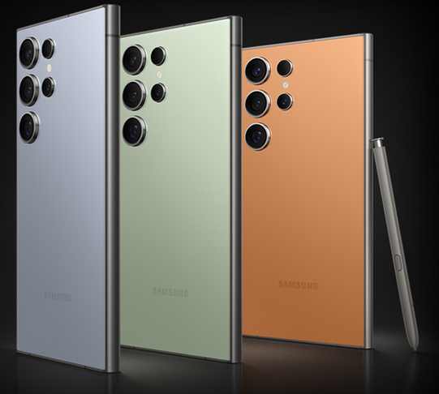
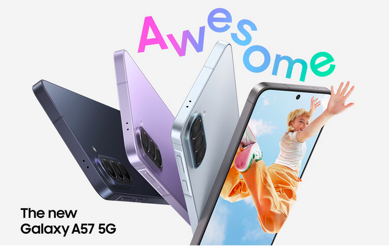
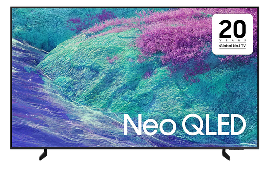
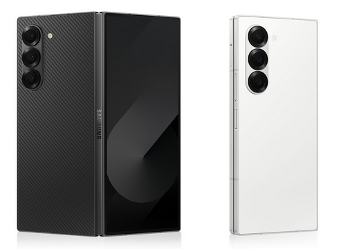
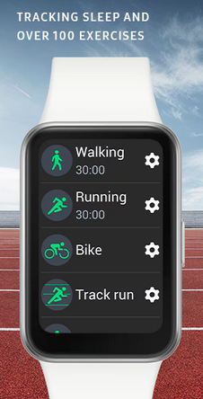
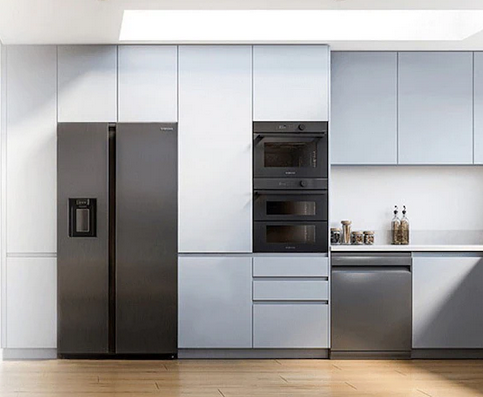
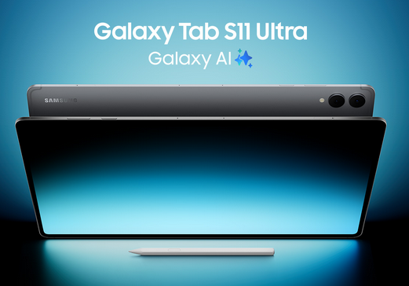
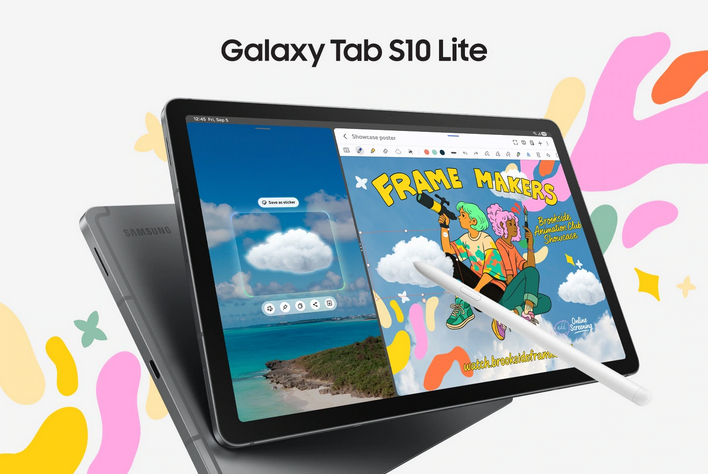

## كود خصم سامسونج السعودية: **AFM117**

إذا كنت تبحث عن أفضل عروض سامسونج في السعودية، سواء لشراء **هاتف Galaxy جديد**، أو **شاشة Neo QLED**، أو **ثلاجة Bespoke**، أو **ساعة Fit3**، فالكود **AFM117** يمنحك خصماً يصل إلى **15%** حسب نوع المنتج.

---

## تفاصيل الخصم

| الفئة | نسبة الخصم | أمثلة المنتجات |
|------|------------|----------------|
| **الإلكترونيات الاستهلاكية** | **15%** | شاشات، ثلاجات، غسالات، مكيفات |
| **فئة MX (الأجهزة الذكية)** | **5%** | هواتف Galaxy – أجهزة لوحية – Wearables |

> ⚠️ **تنبيه:** الكود محدود الميزانية وقد يتوقف عند استهلاك الحد المخصص.

---

## الفرق بين أجهزة التابلت 5G و WiFi

كثير من المستخدمين يتساءلون عن سبب اختلاف السعر بين النسختين رغم تشابه المواصفات. إليك التوضيح المختصر:

### الفرق الأساسي

| الإصدار | الاتصال | شريحة SIM | الاستخدام |
|---------|----------|------------|-----------|
| **WiFi** | عبر WiFi فقط | لا | مناسب للاستخدام المنزلي |
| **5G** | WiFi + شبكة الجوال | نعم | مناسب للتنقل والعمل الميداني |

### لماذا نسخة 5G أغلى؟

| السبب | التوضيح |
|-------|----------|
| **مودم 5G إضافي** | تكلفة تصنيع أعلى |
| **رسوم ترخيص** | تدفعها سامسونج لشركات مثل كوالكوم |

**فارق السعر المعتاد:** بين **150 – 400 ريال** حسب الطراز.

### أيهما يناسبك؟

| استخدامك | الخيار الأفضل | السبب |
|----------|----------------|--------|
| استخدام منزلي أو مكتبي | **WiFi** | لا تحتاج اتصالاً خلوياً |
| تنقل ودراسة | **5G** | إنترنت دائم |
| لديك باقة بيانات كبيرة | **WiFi** | استخدم Hotspot |
| سفر أو عمل ميداني | **5G** | اتصال مستمر |

---

## مثال واقعي — Galaxy Tab A9+

| الإصدار | السعر |
|---------|--------|
| WiFi 128GB | ~ 650 ريال |
| 5G 128GB | ~ 760 ريال |

---

## أفضل منتجات سامسونج مبيعاً في السعودية

### مقارنة سريعة

| المنتج | الفئة | الخصم | السعر | الأفضل لـ |
|--------|--------|--------|--------|-----------|
| **Galaxy S24 Ultra** | هواتف | 5% | ~ 4500 ريال | الفخامة |
| **Galaxy A57** | هواتف | 5% | ~ 1200 ريال | الميزانية |
| **Neo QLED 4K** | شاشات | 15% | ~ 3500 ريال | مشاهدة فاخرة |
| **Galaxy Z Fold6** | هواتف | 5% | ~ 7000 ريال | الإنتاجية |
| **Galaxy Fit3** | Wearables | 5% | ~ 300 ريال | اللياقة |
| **ثلاجة Bespoke** | أجهزة منزلية | 15% | ~ 4000 ريال | التصميم |
| **Galaxy Tab S11** | لوحي | 5% | ~ 3000 ريال | العمل |
| **Galaxy Tab S10 Lite** | لوحي | 5% | ~ 1500 ريال | الطلاب |

---

## Galaxy S24 Ultra

- خصم **5%** مع الكود  
- شاشة 6.8 بوصة – كاميرا 200MP – قلم S Pen  
- [شراء الآن](https://www.samsung.com/sa_en/smartphones/galaxy-s24-ultra/)

---

## Galaxy A57

- خصم **5%**  
- أداء ممتاز وسعر مناسب  
- [شراء الآن](https://www.samsung.com/sa_en/smartphones/galaxy-a/galaxy-a57-5g-awesome-navy-128gb-sm-a576bdbmmea/)

---

## شاشة Neo QLED 4K

- خصم **15%**  
- Mini LED – ذكاء اصطناعي  
- [شراء الآن](https://www.samsung.com/sa_en/tvs/qled-tv/qn1ef-55-inch-neo-qled-4k-mini-led-smart-tv-qa55qn1efauxsa/)

---

## Galaxy Z Fold6

- خصم **5%**  
- شاشة قابلة للطي – إنتاجية عالية  
- [شراء الآن](https://www.samsung.com/sa_en/smartphones/galaxy-z-fold6/)

---

## Galaxy Fit3

> "راقب صحتك بذكاء، كل يوم"

- خصم **5%**  
- بطارية 13 يوم – أكثر من 100 تمرين  
- [شراء الآن](https://www.samsung.com/sa_en/watches/galaxy-fit/galaxy-fit3-gray-bluetooth-v5-3-sm-r390nzaamea/)

---

## ثلاجة Bespoke

- خصم **15%**  
- تصميم قابل للتخصيص  
- [شراء الآن](https://www.samsung.com/sa_en/refrigerators/bespoke-refrigerator/)

---

## Galaxy Tab S11

- خصم **5%**  
- شاشة 11 بوصة – قلم S Pen  
- [شراء الآن](https://www.samsung.com/sa_en/tablets/galaxy-tab-s11/buy/)

---

## Galaxy Tab S10 Lite

- خصم **5%**  
- مناسب للطلاب  
- [شراء الآن](https://www.samsung.com/sa_en/tablets/galaxy-tab-s/galaxy-tab-s10-lite-coralred-128gb-sm-x400nzramea/)

---

## شروط استخدام الكود

- صالح مرة واحدة لكل مستخدم  
- يعمل فقط طالما الميزانية متوفرة  
- صالح على متجر سامسونج السعودية  
- غير صالح على الإكسسوارات

---

## طريقة استخدام الكود

1. اختر المنتج  
2. أضفه للسلة  
3. أدخل الكود: **AFM117**  
4. سيظهر الخصم تلقائياً  
5. أكمل الدفع  

---

## لا تنتظر — الميزانية محدودة

- الأكواد محدودة  
- الميزانية تُستهلك بسرعة  
- الأفضل استخدام الكود فوراً  

> 💡 **نصيحة:** أعلى خصم تحصل عليه يكون على **الإلكترونيات الاستهلاكية** (15%).

---

## اقتباس ملهم

> **"لا تبيع المنتج… بل الحلم الذي يصنعه في ذهن العميل."**  
> – راي ليونيل

---

## هدية مجانية لك 🎁 — ملف دراسة جدوى مقهى (PPTX)

**ملف دراسة جدوى مقهى – نسخة قابلة للتعديل (PPTX)**  
مناسب للطلاب ورواد الأعمال.

### تحميل الملف

[**⬇️ اضغط هنا لتحميل الملف (PPTX)**](https://nemahalsayed.github.io/NDesignstudyosu/files/Coffee_Shop_Feasibility_Study.pptx)

- الملف آمن  
- قابل للتعديل  
- جاهز للاستخدام  

---

## لماذا أقدّم هذا الملف مجاناً؟

- **أنا:** أحصل على عمولة بسيطة عند الشراء بالكود  
- **أنت:** تحصل على خصم + ملف مجاني  
- **الجميع يستفيد**  

---

