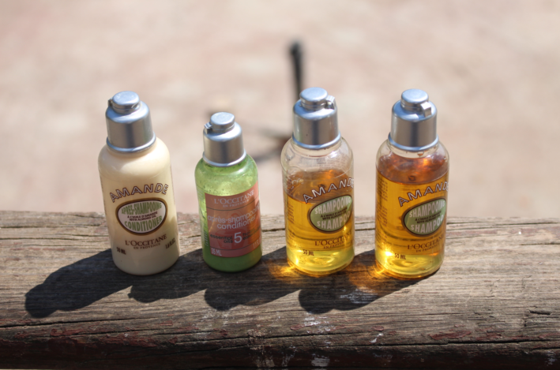
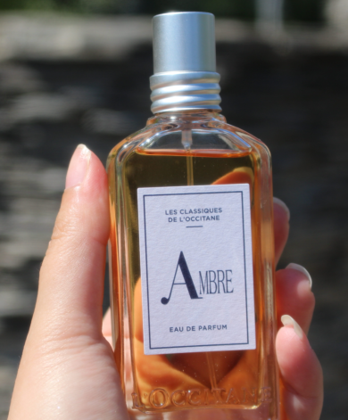
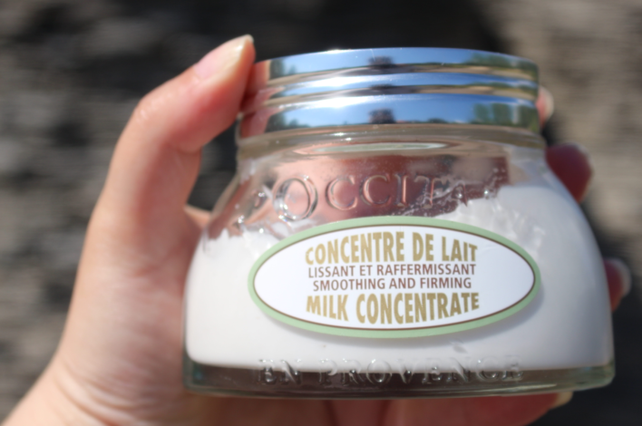
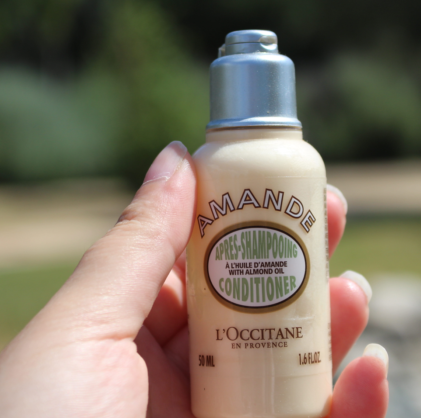
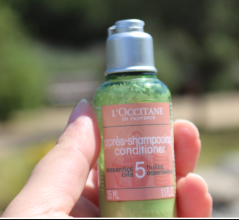


<!DOCTYPE html>
<html lang="ar" dir="rtl">
<head>
    <meta charset="UTF-8">
    <meta name="viewport" content="width=device-width, initial-scale=1.0, viewport-fit=cover">
    <title>اكتشافي مع L'Occitane: 5 منتجات غيرت روتيني اليومي</title>

    
</head>

<body>
    

        <!-- ===== HERO ===== -->
        

            <h1>اكتشافي مع L'OCCITANE</h1>
            
5 منتجات غيرت روتيني اليومي

            

                رحلة شخصية بين العطور والعناية… مع كود خصم حصري <strong>A162</strong>
            

            

                ✦ 15% خصم في السعودية &nbsp;·&nbsp; 10% خصم في الإمارات والكويت ✦
            

        

        <!-- ===== STORY INTRO ===== -->
        

            

                في شي حلو لما تكتشف منتج تحس إنه معمول عشانك أنت بالذات.
                مو لأنه غالي أو مشهور — لا، لأنه <strong>يفهمك</strong>.
                وهذا بالضبط اللي حسيت فيه لما دخلت عالم L'OCCITANE. ومن يومها وأنا ما التفت وراي.
            

            

                هذي مو مراجعة عادية. هذي <strong>قصة تجربتي الشخصية</strong> مع خمس منتجات من L'OCCITANE صارت جزء من روتيني اليومي —
                ومع كود الخصم الحصري <strong>A162</strong>، تقدر تستمتع بنفس الرفاهية بسعر أقل.
            

            

                بصراحة؟ كنت مترددة قبل ما أشتري منتجات فاخرة. كنت أفكر، <em>"هل تستحق السعر؟"</em>
                لكن بعد أول تجربة لي مع مجموعة L'OCCITANE، تغير شي فيني. الروائح. القوام. الشعور اللي يعطيك إياه كل منتج — وكأنك تعطي نفسك لحظة هدوء في دنيا صاخبة.
            

            

                <strong>ليش أشارككم هالخمس منتجات؟</strong>
                لأنهم هم اللي فرقوا معاي صدق.
                من العطر اللي يعلق بذاكرتك مثل ذكريات دافية، إلى البلسم اللي أعاد الحياة لشعري — كل واحد أخذ مكانه في روتيني.
                وأيوة، أنا جبت لكم كود خصم خاص. إذا استفدت منه، أذكرني بالخير: <strong>A162</strong>.
            

            <!-- Quote Box -->
            

                

                    💡
                    "الرفاهية الحقيقية مو إنك تشتري كثير… الرفاهية إنك تختار شي استثنائي وتستمتع فيه كل يوم."
                

            

            

                تخيل تبدأ يومك بشامبو ريحته لوز حلو،
                وتختمه بعطر يحضنك بدفء.
                هالخمس منتجات هي بالضبط اللي كنت أحتاجها — وأنا متأكدة إنكم بتحبونها قد ما حبيتها.
            

        

        <!-- ===== FEATURED IMAGE ===== -->
        

            

                
            

            
مجموعتي من L'OCCITANE — كل منتج له قصة ✦

        

        <!-- ===== PRODUCT GRID ===== -->
        

            <!-- PRODUCT 1: Ambre Perfume -->
            

                

                    
                

                

                    

                        ★★★★★
                        (124 تقييم)
                    

                    <h3>عطر Ambre Eau de Parfum 50ml</h3>
                    

                        إذا كنتي تدورين عطر يحسسك بالدفء، هذا هو.
                        مزيج من الفانيليا، المسك، والباتشولي — أنثوي، أنيق، وما ينسى.
                        كل ما ألبسه، أحد يسألني عن ريحته.
                    

                    <a href="https://sa.loccitane.com/new/ambre-eau-de-parfum/23EP050AMR25.html?lang=en_SA&pdpHit=true" class="btn-shop" target="_blank">تسوق الآن</a>
                

            

            <!-- PRODUCT 2: Milk Concentrate -->
            

                

                    
                

                

                    

                        ★★★★★
                        (89 تقييم)
                    

                    <h3>مكثف الحليب — Milk Concentrate</h3>
                    

                        تخيلي حليب كريمي يلتقي بالعناية الفاخرة. هذا المكثف كل شي كانت بشرتي تحتاجه.
                        غني بدون ما يكون دهني، يرطب بدون ما يكون ثقيل.
                        بعد يوم طويل، تطبيقه يحسسك إنك رجعت البيت.
                    

                    <a href="https://sa.loccitane.com/body-care/milk-concentrate/" class="btn-shop" target="_blank">تسوق الآن</a>
                

            

            <!-- PRODUCT 3: Mini Amande Shampoo -->
            

                

                    
                

                

                    

                        ★★★★☆
                        (67 تقييم)
                    

                    <h3>شامبو Amande المصغر</h3>
                    

                        هالزجاجة الصغيرة فيها قوة. بزيت اللوز في قلبها، تنظف بدون ما تجفف.
                        شعري صار ناعم، سهل التصفيف، ولامع بشكل مفاجئ من أول استعمال.
                        وريحتها — ريحة L'OCCITANE الشهيرة باللوز — أحلام.
                    

                    <a href="https://sa.loccitane.com/hair-care/almond-amande-shampoo-mini/" class="btn-shop" target="_blank">تسوق الآن</a>
                

            

            <!-- PRODUCT 4: Mini 5 Essential Oils Conditioner -->
            

                

                    
                

                

                    

                        ★★★★★
                        (103 تقييم)
                    

                    <h3>بلسم 5 زيوت عطرية مصغر</h3>
                    

                        هذا البلسم اللي ما كنت أدري إني أدور عليه. لافندر، يلانغ يلانغ، إبرة الراعي، برتقال، وإكليل الجبل — وكأنه علاج سبا في أنبوب.
                        شعري صار حيوي، ناعم، وصحي بعد كم استخدام.
                    

                    <a href="https://sa.loccitane.com/hair-care/5-essential-oils-conditioner-mini/" class="btn-shop" target="_blank">تسوق الآن</a>
                

            

            <!-- PRODUCT 5: Mini Amande Conditioner -->
            

                

                    
                

                

                    

                        ★★★★★
                        (78 تقييم)
                    

                    <h3>بلسم Amande بزيت اللوز المصغر</h3>
                    

                        مع شامبو Amande، هذا البلسم تركيبة سماوية.
                        مغذي بدون ما يكون ثقيل — يفك التشابك، ينعم، ويخلي شعري حرير.
                        ريحته تحضنني بدفء كل ما استخدمه.
                    

                    <a href="https://sa.loccitane.com/hair-care/almond-amande-conditioner-mini/" class="btn-shop" target="_blank">تسوق الآن</a>
                

            

        

        <!-- END PRODUCT GRID -->

        <!-- ===== COUPON BOX ===== -->
        

            <h3>✨ كود الخصم الحصري ✨</h3>
            
A162

            
15% خصم في السعودية &nbsp;·&nbsp; 10% خصم في الإمارات والكويت

            

                لا تنتظرين العروض الموسمية — هالمنتجات نادراً ما تنزل عليها خصومات،
                وكود <strong>A162</strong> هو بوابتك للرفاهية الذكية.
            

            

                جربي أحد هالمنتجات اليوم وشاركينا تجربتك في التعليقات.
                أنتِ تستحقين الشعور بالرفاهية… كل يوم.
            

        

        <!-- ===== FOOTER ===== -->
        

            
✦ مراجعة شخصية لمنتجات L'OCCITANE ✦

            

                الكود A162 يسري على المنتجات غير المخفضة &nbsp;&nbsp; ساري في السعودية، الإمارات والكويت
            

            
جميع الحقوق محفوظة &nbsp;·&nbsp; N Design Studio 2026

        

    

    <!-- END BLOG CARD -->
</body>
</html>
