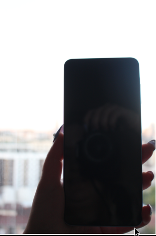
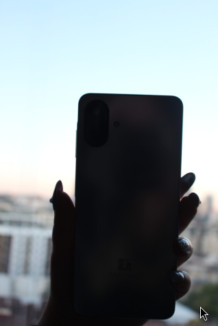
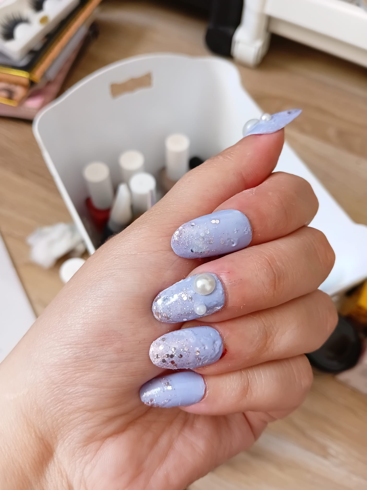
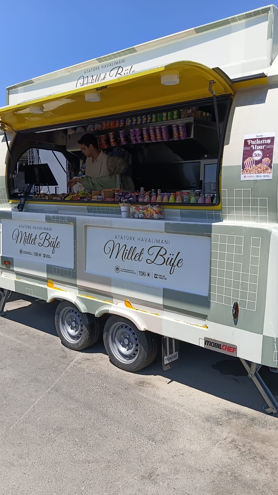
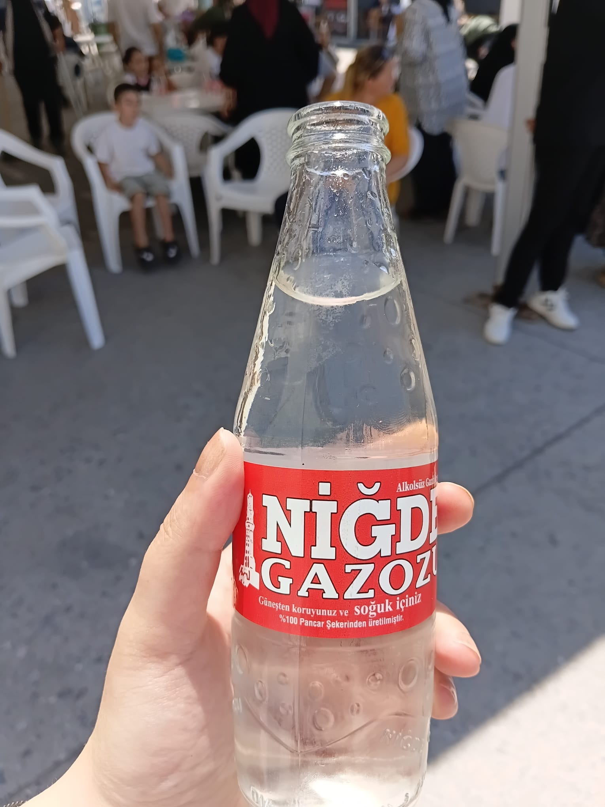
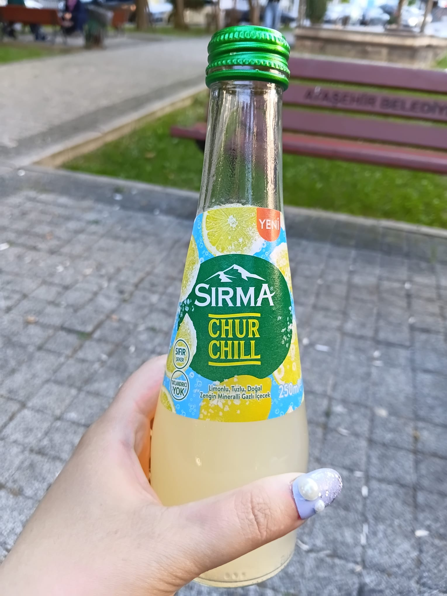


<!DOCTYPE html>
<html lang="ar" dir="rtl">
<head>
    <meta charset="UTF-8">
    <meta name="viewport" content="width=device-width, initial-scale=1.0">
    <title>مراجعة هاتف سامسونج بعد أسبوعين + كود خصم (AFM117) بقيمة 200 ريال</title>
    
</head>
<body>

    <h1>مراجعة هاتف سامسونج بعد أسبوعين + كود خصم (AFM117) بقيمة 200 ريال</h1>
    

        🇸🇦 السعودية
        — 12 يوليو 2026 · استخدام لمدة أسبوعين
    

    

        ⭐ جالاكسي A07 5G · أداء سلس · كاميرا مذهلة
    

    

    <h2>أسبوعان مع جالاكسي A07 5G – وانبهرت!</h2>
    
منذ أسبوعين، قمت بفتح صندوق <strong>جالاكسي A07 5G</strong> باللون البنفسجي الفاتح الرائع. لقد استخدمت هواتف رائدة من قبل، لكن هذا الهاتف المتوسط الفئة فاجأني حقًا. إنه سلس، سريع، والكاميرا تقدم أداءً أفضل بكثير مما توقعت مقابل هذا السعر.

    
سواء كنت في السعودية أو تركيا، يحمل هذا الهاتف نفس الاسم: <strong>جالاكسي A07 5G</strong>. وبعد 14 يومًا من الاستخدام المكثف، يمكنني القول بثقة إنه واحد من أفضل هواتف 5G من حيث القيمة مقابل المال في السوق حاليًا.

    <h2>ماذا يوجد في العلبة؟ (والانطباعات الأولى)</h2>
    
الهاتف نفسه هو النجم. يتميز الجزء الخلفي بلمعان راقٍ خفيف، ولون البنفسجي الفاتح رائع جدًا. إنه خفيف الوزن (199 جرام) ومريح في اليد. مستشعر البصمة الجانبي سريع، وشاشة 6.7 بوصة غامرة منذ اللحظة الأولى.

    <h2>الأداء: سلس، سريع، وموثوق</h2>
    
تحت الغطاء، يعالج <strong>معالج 6 نانومتر ثماني النواة</strong> (2.4 جيجاهرتز + 2 جيجاهرتز) كل ما أرميه عليه. من التمرير في وسائل التواصل الاجتماعي إلى الألعاب العادية (Asphalt 9، Call of Duty Mobile)، يظل الهاتف سلسًا كالحرير. <strong>معدل تحديث 120 هرتز</strong> على شاشة PLS LCD مقاس 6.7 بوصة يجعل التمرير والتنقل سلسًا بشكل لا يصدق. يصل السطوع إلى 800 شمعة، لذا تظل الشاشة واضحة حتى تحت أشعة الشمس السعودية الحارقة.

    
مع <strong>ذاكرة وصول عشوائي 4 جيجابايت وذاكرة تخزين 128 جيجابايت</strong> (قابلة للتوسيع حتى 2 تيرابايت عبر microSD)، أصبح تعدد المهام أمرًا سهلاً. لقد فتحت أكثر من 10 تطبيقات دون أي تباطؤ ملحوظ. كما أن <strong>اتصال 5G</strong> سريع وموثوق – حصلت باستمرار على سرعات ممتازة في جدة والرياض.

    

        <table>
            <tr><td class="label">الشاشة</td><td class="value">6.7 بوصة PLS LCD، 120 هرتز، 800 شمعة (HBM)</td></tr>
            <tr><td class="label">المعالج</td><td class="value">6 نانومتر ثماني النواة (2.4 جيجاهرتز + 2 جيجاهرتز)</td></tr>
            <tr><td class="label">الكاميرا الخلفية</td><td class="value">50 ميجابكسل (f/1.8) + 2 ميجابكسل (f/2.4) + فلاش LED</td></tr>
            <tr><td class="label">الكاميرا الأمامية</td><td class="value">8 ميجابكسل (f/2.0)</td></tr>
            <tr><td class="label">البطارية</td><td class="value">6000 مللي أمبير · تدوم طويلاً</td></tr>
            <tr><td class="label">التخزين / الرام</td><td class="value">128 جيجابايت / 4 جيجابايت · microSD حتى 2 تيرابايت</td></tr>
            <tr><td class="label">المتانة</td><td class="value">مقاومة للغبار والرذاذ IP54</td></tr>
            <tr><td class="label">نظام التشغيل والتحديثات</td><td class="value">6 ترقيات لنظام التشغيل · 6 سنوات تحديثات أمنية</td></tr>
        </table>
    

    <h2>أداء الكاميرا – جودة احترافية بدقة 50 ميجابكسل</h2>
    
<strong>كاميرا Pro-Grade بدقة 50 ميجابكسل</strong> هي النقطة المميزة بالنسبة لي. يلتقط المستشعر الرئيسي (f/1.8) ألوانًا غنية وتفاصيل دقيقة. في ضوء النهار، تكون الصور واضحة ونابضة بالحياة. يعالج معالج الصور المتقدم الضوء والظل بشكل جيد، حتى في ظروف الإضاءة الصعبة، مما ينتج صورًا واضحة بجودة احترافية. يساعد مستشعر العمق 2 ميجابكسل في وضع البورتريه، وفلاش LED مفيد في حالات الإضاءة المنخفضة.

    
<strong>الكاميرا الأمامية 8 ميجابكسل</strong> (f/2.0) جيدة للصور الشخصية ومكالمات الفيديو – فهي تتعامل مع وضع البورتريه بشكل جيد وتلتقط تفاصيل مناسبة في الإضاءة الجيدة.

    

        
        
        
        
        
    

    
⬆️ بعض الصور التي التقطتها باستخدام A07 5G (بدون تعديل، مباشرة من الكاميرا).

    <h2>بطارية تدوم طويلاً</h2>
    
بفضل <strong>بطارية 6000 مللي أمبير</strong> الضخمة، هذا الهاتف عداء ماراثون. أحصل بسهولة على يوم كامل من الاستخدام المكثف – بث، ألعاب، تصفح – ويتبقى لدي 30-40٪ عند النوم. إنه مثالي لمشاهدة المسلسلات أو الرحلات الطويلة دون القلق بشأن الشحن.

    <h2>البرمجيات، المتانة، والإضافات</h2>
    
<strong>واجهة One UI</strong> نظيفة وبديهية ومليئة بالميزات المفيدة. يأتي الهاتف مع <strong>6 ترقيات رئيسية لنظام التشغيل و6 سنوات من التحديثات الأمنية</strong> – وهذا أمر مذهل لهاتف متوسط الفئة. بالإضافة إلى ذلك، <strong>مقاومة الغبار والرذاذ IP54</strong> تعني أنه يمكنه التعامل مع رذاذ الماء والبيئات المتربة والمطر دون عناء.

    
تشمل الميزات الأخرى <strong>مشاركة سريعة (Quick Share)</strong> لنقل الملفات بسهولة، و<strong>Smart Switch</strong> للترحيل السهل من iOS، و<strong>منفذ 3.5 ملم</strong> – إضافة مرحب بها لعشاق الصوت.

    

    <h2>مستعد لتجربته؟ إليك كيفية توفير 200 ريال</h2>
    
بعد أسبوعين، سأبقي هذا الهاتف كجهازي الرئيسي. إنه سريع وموثوق والكاميرا رائعة حقًا. إذا كنت تبحث عن هاتف 5G لن يكسر ميزانيتك، فإن Galaxy A07 5G هو خيار ممتاز. ملاحظة شخصية: العلبة تحتوي على كابل ودبوس إخراج البطاقة والهاتف، بينما الملحقات الإضافية مثل رأس الشاحن وغطاء الشاشة يتم شراؤها بشكل منفصل.

    
<strong>وهذا هو الجزء الأفضل:</strong> يمكنك الحصول عليه <strong>بخصم 200 ريال</strong> باستخدام كود الخصم الخاص بي.

    

        🎁 وفر 200 ريال
        
استخدم الكود عند الدفع على موقع سامسونج السعودية

        
AFM117

        
ساري حتى 31 يوليو 2026 · الحد الأدنى للشراء 999 ريال

    

    

        <a href="https://www.samsung.com/sa_en/smartphones/galaxy-a/galaxy-a07-5g-light-green-128gb-sm-a076elgbmea/" target="_blank" class="cta-button">
            👉 جرب Galaxy A07 5G وطبّق AFM117
        </a>
    

    
اضغط أعلاه لزيارة صفحة سامسونج الرسمية واحصل على 200 ريال خصم باستخدام كود <strong>AFM117</strong>.

    
— مراجعة مبنية على الاستخدام الشخصي، وليست محتوى مدعوم. مجرد مستخدم سعيد.

</body>
</html>
