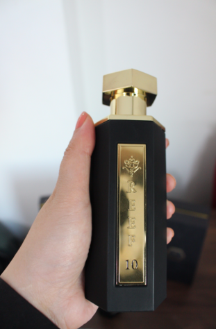
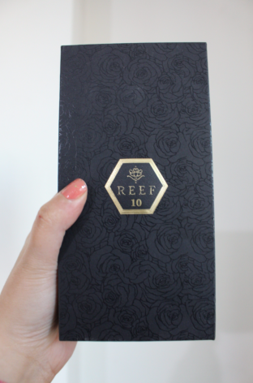
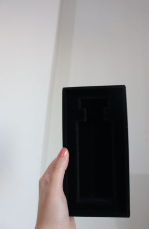
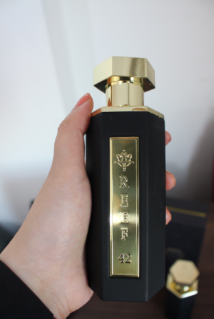
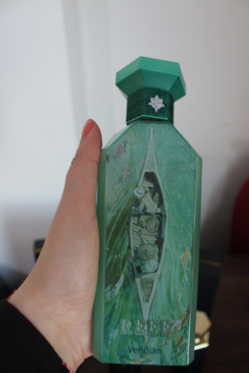

<!DOCTYPE html>
<html lang="ar" dir="rtl">
<head>
  <meta charset="UTF-8" />
  <meta name="viewport" content="width=device-width, initial-scale=1.0" />
  <title>مراجعة عطور Reef · خصم 5% مع B64 · ملاحظاتي الصادقة</title>
  
</head>
<body>

  <!-- header -->
  

    <h1>مراجعة عطور Reef · خصم 5% مع B64</h1>
    📸 صوري · ملاحظات صادقة
  

  

    🇸🇦 يوميات عطرية شخصية · 2026
    ✨ الكود: B64 · خصم 5% على المتجر
  

  <!-- intro -->
  

    
<strong>⚡ كلام من القلب:</strong> أرتدي عطور <strong>Reef</strong> منذ أشهر — هذه الأربعة هي تشكيلتي الشخصية.  جميع الصور التقطتها بنفسي بعد الشراء. هذه ليست مراجعة مدفوعة، فقط ملاحظات صادقة.

    
استخدم كود الخصم الخاص بي B64 عند الدفع للحصول على <strong>خصم 5%</strong> على طلبك (يشمل المتجر بأكمله).

  

  <!-- perfume grid : 10, 15, 42 -->
  

    <!-- Reef 10 -->
    

      

        

          📸 Reef 10 · صورتيصورتي';">
          صورتي
        

        

          📸 Reef 10 · صورتيصورتي';">
          صورتي
        

      

      <h3>Reef 10</h3>
      
منعش · بحري · أخضر

      <ul class="note-list">
        <li><strong>الافتتاحية:</strong> برغموت، ملح البحر، هيل</li>
        <li><strong>القلب:</strong> ورق البنفسج، إبرة الراعي، فلفل وردي</li>
        <li><strong>القاعدة:</strong> خشب الأرز، العنبر، طحلب البلوط</li>
      </ul>
      
<i>🗒️</i> ملاحظاتي: منعش، بحري، يدوم 6 ساعات · مثالي للنهار

    

    <!-- Reef 15 -->
    

      

        📸 Reef 15 · صورتيصورتي';">
        صورتي
      

      <h3>Reef 15</h3>
      
حار · خشبي · دافئ

      <ul class="note-list">
        <li><strong>الافتتاحية:</strong> زعفران، جريب فروت، إيلمي</li>
        <li><strong>القلب:</strong> جوزة الطيب، قرفة، كلاري سيج</li>
        <li><strong>القاعدة:</strong> خشب الصندل، باتشولي، تونكا</li>
      </ul>
      
<i>🗒️</i> ملاحظاتي: جريء ودافئ · القرفة وخشب الصندل يبرزان

    

    <!-- Reef 42 (full width) -->
    

      

        📸 Reef 42 · صورتيصورتي';">
        صورتي
      

      <h3>Reef 42</h3>
      
زهري · عنبري · إدماني

      <ul class="note-list">
        <li><strong>الافتتاحية:</strong> يوسفي، كشمش أسود، فلفل وردي</li>
        <li><strong>القلب:</strong> ورد، ياسمين، سوسن، زهر البرتقال</li>
        <li><strong>القاعدة:</strong> فانيليا، عنبر، بنزوين، خشب الجاياك</li>
      </ul>
      
<i>🗒️</i> ملاحظاتي: راقي ودافئ · مزيج زهري-عنبرى، يحظى بإطراءات كثيرة

    

  

  <!-- Veridian block -->
  

    

      <h3>🌿 Veridian · Reef</h3>
      
أخضر · عطري · مشرق

      

        📸 Veridian · صورتيصورتي';">
        صورتي
      

      <ul class="note-list">
        <li><strong>الافتتاحية:</strong> ريحان، ليم، نعناع، ليمون</li>
        <li><strong>القلب:</strong> جالبانوم، خزامى، بتيتغرين، إكليل الجبل</li>
        <li><strong>القاعدة:</strong> فيتيفير، مسك، طحلب البلوط، أرز أبيض</li>
      </ul>
      

        🗒️ ملاحظاتي: عشبي، منعش، مثل حديقة البحر المتوسط · فريد ومنعش
      

    

    
📸 صورتي · Veridian

  

  <!-- final note: original photos & purchase -->
  

    

      📸 صور أصلية جميع الصور التقطتها بنفسي
    

    
⚡ تم الشراء والمراجعة · 100% من تجربتي، تدوم الرائحة طوال اليوم، خيارات مثالية للاستخدام اليومي أو الليل

  

  

  

    <a href="#" onclick="alert('تم تطبيق كود الخصم B64! (عرض توضيحي)')">🛒 استخدم كود B64 · خصم 5%</a>
    <small>متجر Reef · الخصم صالح مع كود B64 (كودي الشخصي)</small>
  

  

    Reef 10 · Reef 15 · Reef 42 · Veridian — جميعها مختبرة وأصلية
  

</body>
</html>