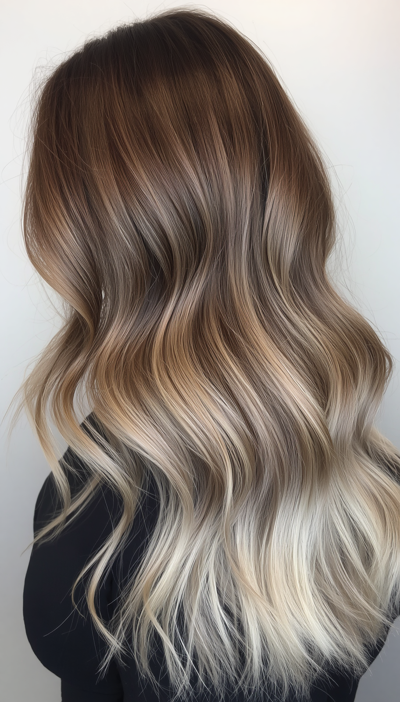
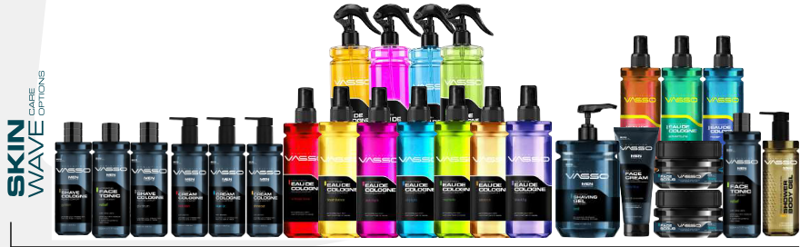


    

    <!-- TITLE & META -->
    <h1>فاسو من أورجانيكا: حلول جمال وعناية معتمدة ومفعمة بالحيوية لسوق الخليج</h1>

    

        يوليو ٢٠٢٦
        ✦ مفعم بالحيوية والشباب
        سوق الخليج
        معتمد من CPNP وFDA
    

    <!-- LEAD -->
    

        <strong>فاسو من أورجانيكا</strong> تجمع بين أداء المنتج، والثقة التنظيمية، والتقديم الراقي للموزعين، وأصحاب الصالونات، وتجار التجزئة في جميع أنحاء سوق الخليج. العلامة التجارية <strong>مفعمة بالحيوية، والألوان، وتمنح شعوراً شبابياً</strong> لكل عميل يدخل من أبوابهم.
    

    

        في مشهد الجمال التنافسي، يتوقع <strong>الموزعون</strong> أكثر من مجرد لون أو عطر. <strong>إنهم</strong> يبحثون عن جودة متسقة، وامتثال واضح، ومنتجات تدعم تجربة عملاء متميزة. تم وضع فاسو لتلبية هذه التوقعات عبر العناية الاحترافية بالشعر، والعناية الرجالية، وعطور الجو — بطاقة مميزة تتناغم مع المستهلك الخليجي الحديث.
    

    <!-- BRAND VIBE CALL OUT -->
    

        

            ✦ فاسو ليست مجرد خط إنتاج — إنها تجربة مفعمة بالحيوية والشباب تضفي طاقة على كل رف، وكل كرسي صالون، وكل روتين عناية. ✦
        

    

    <!-- SECTION 1: WOMEN'S HAIR -->
    <h2>صبغات شعر احترافية وعناية بعمق تقني</h2>

    

        تجمع مجموعة العناية الاحترافية بالشعر للنساء بين أداء الألوان الموثوق ومنتجات الدعم العلاجية. إلى جانب تشكيلة صبغات الشعر الأساسية، سيجد <strong>الموزعون</strong> نظام عناية كاملًا مصممًا للاستخدام في الصالونات والتجزئة — من زبدة الشعر المغذية إلى شامبوهات تثبيت اللون التي تحافظ على نضارة الألوان وحيويتها.
    

    

        زبدة وأقنعة الشعر (أرغان + كيراتين)
        شامبوهات وبلسم مثبتة للألوان
        مساحيق تبييض ميكرونية
        سيرومات وبلسم يترك على الشعر
        ألوان كريمية شبه دائمة ودائمة
        بخاخات تونر مهدئة لفروة الرأس
    

    <!-- ============================================= -->
    <!-- PHOTO GRID – SINGLE COLUMN (FULL WIDTH)       -->
    <!-- ============================================= -->

    <!-- Photo 1: The Ombre Look -->
    

        

            
            
✦ أومبير الصيف — 5.00 كستنائي · 7.3 ذهبي · 8.11 رمادي · 10.11 رمادي

        

        <!-- Photo 2: Vasso Product Line -->
        

            
            
✦ مجموعة فاسو الكاملة — شعر · رجالي · عطور منزلية

        

        <!-- Photo 3: Men's Wax Collection -->
        

            
            
✦ شمع تصفيف رجالي — تثبيت فائق · غير لامع · ليفي · طيني

        

        <!-- Photo 4: Men's After Shave Collection -->
        

            
            
✦ ما بعد الحلاقة — مهدئ · ألانتوين · عطور مميزة

        

    

    <!-- HAIR COLOR REVIEW / CASE STUDY -->
    <h3>تركيبة أومبير صيفية بجاذبية تجارية</h3>

    

        توضح إحدى تركيبات الصالونات المميزة كيف تدعم المجموعة التحكم الدقيق في الدرجات اللونية مع الحفاظ على لمسة نهائية ناعمة وراقية. يمكن لمصفف الشعر إنشاء إطلالة أومبير صيفية مصقولة باستخدام المزيج التالي:
    

    

        <ul>
            <li><strong>الجذور:</strong> 5.00 كستنائي + 7.3 ذهبي متوسط (أجزاء متساوية) – قاعدة دافئة وطبيعية</li>
            <li><strong>الأطوال المتوسطة:</strong> 8.11 رمادي + نقطة بنفسجية – انتقال بارد ومدخن، يحيد الصفار</li>
            <li><strong>الأطراف:</strong> 10.11 رمادي – لمسة نهائية مشرقة عالية الرفع بتأثير الشمس</li>
        </ul>
        

            تسلط هذه التركيبة الضوء على مرونة فاسو في مزج الدرجات اللونية مع حماية سلامة الشعر. يمكن <strong style="color:#783b5a;">للعملاء</strong> أيضًا تسويق المجموعة بثقة بفضل الاختبارات الجلدية والتركيبات المتوازنة pH المصممة لفروة الرأس الحساسة.
        

    

    <!-- SECTION 2: MEN'S GROOMING – EXPANDED -->
    <h2>العناية الرجالية: طاقة شبابية، أداء متميز</h2>

    

        بالنسبة للرجل الخليجي الحديث، تعد العناية الشخصية تعبيرًا عن الثقة والأناقة. صممت <strong>المجموعة الرجالية</strong> بطاقة <strong>شبابية مفعمة بالحيوية</strong> تجذب العملاء المميزين الذين يقدرون الجودة والعطر والتقديم. يمكن <strong>للموزعين</strong> تقديم خزانة عناية كاملة لعملائهم:
    

    

        ماء كولونيا (روائح خشبية وحمضية)
        تونر للوجه والشعر (حبة البركة + إكليل الجبل)
        جل استحمام وغسول للجسم
        شمع تصفيف وطين مات (تثبيت عالي)
        بلسم ما بعد الحلاقة خالٍ من الكحول (صبار + بابونج)
        زيوت لحية، بلسم تليين، وشمع تشكيل
        أمشاط وأطقم شارب ولحية
        مقشرات وجه مقشرة بالرماد البركاني
    

    <!-- ============================================= -->
    <!-- SPOTLIGHT: WAX & AFTER SHAVE (from catalog)    -->
    <!-- ============================================= -->
    <h3>تسليط الضوء: شمع التصفيف — تشكيل بثقة</h3>

    

        تقدم مجموعة شمع التصفيف من فاسو مجموعة من اللمسات النهائية ومستويات التثبيت، مما يضمن لكل عميل إيجاد المطابقة المثالية. من المات الفائق إلى اللمعان الرطب، صممت هذه الشموع لجميع أنواع الشعر ويمكن إعادة تشكيلها بسهولة بالمشط طوال اليوم.
    

    

        

            <h4>✦ شمع تصفيف Pro-Aqua Resist</h4>
            <ul>
                <li>تثبيت فائق مع لمعان طبيعي</li>
                <li>مثالي للشعر العادي والقصير</li>
                <li>إعادة تشكيل سهلة بالمشط</li>
            </ul>
        

        

            <h4>✦ شمع تصفيف Pro-Matte Matte Head</h4>
            <ul>
                <li>تثبيت قوي فائق + لمسة نهائية غير لامعة</li>
                <li>مناسب لجميع أنواع الشعر</li>
                <li>تصفيف يدوم طويلاً بإحساس طبيعي</li>
            </ul>
        

        

            <h4>✦ شمع تصفيف Pro-Clay Spike</h4>
            <ul>
                <li>تثبيت صلب إضافي مع مظهر غير لامع إضافي</li>
                <li>يخلق مظهرًا أنيقًا وجذابًا</li>
                <li>مثالي للتصفيفات الملمسية والمدببة</li>
            </ul>
        

        

            <h4>✦ شمع ليفي Black Edition Gravity</h4>
            <ul>
                <li>تركيبة ليفية لتثبيت مثالي ومرن</li>
                <li>تثبيت فائق مع لمسة نهائية لامعة</li>
                <li>مصمم للشعر المتوسط والناعم</li>
            </ul>
        

    

    <h3>تسليط الضوء: ما بعد الحلاقة — راحة تجمع بين العطور المميزة</h3>

    

        تجمع مجموعة ما بعد الحلاقة بين العناية المهدئة للبشرة والعطر الطويل الأمد. تركيباتها المدعومة <strong>بالألانتوين</strong>، مرطب البشرة الحساسة، تمنع التهيج مع ترك عطر راقٍ يدوم طوال اليوم.
    

    

        

            <h4>✦ كولونيا ما بعد الحلاقة Golden</h4>
            <ul>
                <li>عطر زهري دائم</li>
                <li>يمنح الانتعاش والرحابة</li>
                <li>مثالي للرجل المميز</li>
            </ul>
        

        

            <h4>✦ كريم كولونيا ما بعد الحلاقة Kick Start</h4>
            <ul>
                <li>يعتمد على الألانتوين للبشرة الحساسة</li>
                <li>يمنع التهيج دون شعور دهني</li>
                <li>عطر خشبي لتأثير مهدئ يدوم طويلاً</li>
            </ul>
        

        

            <h4>✦ كولونيا ما بعد الحلاقة Premium</h4>
            <ul>
                <li>عطر توابل دائم</li>
                <li>انتعاش وروحانيات طوال اليوم</li>
                <li>ملف عطر جريء وواثق</li>
            </ul>
        

        

            <h4>✦ كريم كولونيا ما بعد الحلاقة Blue Ice</h4>
            <ul>
                <li>مدعم بالألانتوين للبشرة الحساسة</li>
                <li>يمنع التهيج مع تأثير تبريد</li>
                <li>عطر منعش يدوم طويلاً</li>
            </ul>
        

    

    <!-- SECTION 3: AIR FRESHENERS -->
    <h2>عطور المنزل لتجارة التجزئة الفاخرة</h2>

    

        تمتد مجموعة فاسو إلى ما هو أبعد من العناية الشخصية لتشمل <strong>معطرات الجو</strong> الفاخرة، بما في ذلك السوائل المركزة، والناشرات الكهربائية، ومشابك السيارات. مع روائح مستوحاة من <strong>العود العربي، والكتان النقي، والحمضيات المتوسطية، والعنبر المسكي</strong>، يمكن <strong>للعملاء</strong> توسيع تشكيلتهم بمنتجات تناسب قنوات المنزل والسيارات على حد سواء.
    

    <!-- SECTION 4: CERTIFICATIONS -->
    <h2>معايير معتمدة تدعم ثقة السوق</h2>

    

        في سوق مزدحم، غالبًا ما تحدد الشهادات والوثائق ما إذا كانت مجموعة المنتجات قابلة للتوسع. مع <strong>أرقام CPNP وFDA</strong> والتسجيل في أكثر من <strong>١٢٠ دولة</strong>، تقدم فاسو ملف امتثال يعزز ثقة المشترين. يمكن <strong>للعملاء</strong> تقديم هذه الاعتمادات لعملائهم مع العلم أن كل دفعة تتوافق مع المعايير الصارمة للاتحاد الأوروبي والولايات المتحدة.
    

    

        سواء كان <strong>الموزعون</strong> يزودون صالونًا راقيًا، أو صالة عناية رجالية، أو سلسلة تجزئة متعددة العلامات التجارية، فهم مدعومون بعلامة تجارية تعطي الأولوية للفعالية والسلامة وجودة التقديم.
    

    <!-- SECTION 5: PRIVATE LABEL -->
    <h2>علامة خاصة لرواد الأعمال</h2>

    

        للشركات المستعدة لتجاوز التوزيع، تقدم فاسو <strong>تصنيع العلامة الخاصة</strong> الشامل. يمكن <strong>للعملاء</strong> تطوير خطهم الخاص من صبغات الشعر، ومنتجات العناية الرجالية، أو معطرات الجو بتغليف مخصص، وملفات عطرية مصممة حسب الطلب، ودعم تنظيمي مدمج في العملية. تدير فاسو الأساس التقني بينما <strong>هم</strong> يشكلون هوية العلامة التجارية.
    

    <!-- ============================================= -->
    <!-- LUXURY CALL TO ACTION                         -->
    <!-- ============================================= -->
    

        

            <strong>الموزعون، وأصحاب الصالونات، وتجار التجزئة في منطقة الخليج</strong>
        

        

            للحصول على كتالوجات، وكميات بالجملة، وأسعار، وتفاصيل المكونات، ومناقشات العلامة الخاصة، يمكنكم التواصل مباشرة مع <strong>نعمة السيد</strong> للتنسيق التجاري مع فريق أورجانيكا في منطقة الخليج.
        

        

            <a href="mailto: ndesignstudyosu@gmail.com">ndesignstudyosu@gmail.com</a>
        

        

            <em>كتالوجات • كميات • أسعار • استشارات العلامة الخاصة</em>
        

        

            <strong>تواصل مع نعمة السيد</strong> للحصول على دعم مخصص لسوق الخليج، والتفاصيل التجارية، والتنسيق المباشر مع الشركة. ستحصل على صفقة حصرية رائعة.
        

        ✦ عرض حصري لمنطقة الخليج ✦
    

    

        يمكن <strong>للعملاء</strong> اكتشاف كيف تجمع فاسو بين المصداقية التقنية، والطاقة الحيوية، والتقديم الراقي على رفوفهم.
    

    

        عملاؤهم يستحقون الأفضل — شارك مع العلامة التجارية التي تقدم لا أقل.
    

    <!-- FOOTER -->
    

        

            #فاسو
            #أورجانيكا
            #صبغات_شعر
            #عناية_رجالية
            #شمع_تصفيف
            #ما_بعد_الحلاقة
            #علامة_خاصة
            #سوق_الخليج
            #CPNP
            #FDA
        

        

            © ٢٠٢٦ فريق تصدير أورجانيكا
        

    

<!-- end post-container -->
