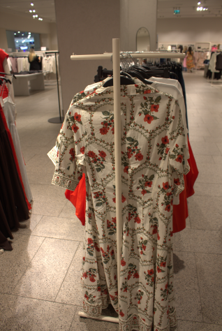
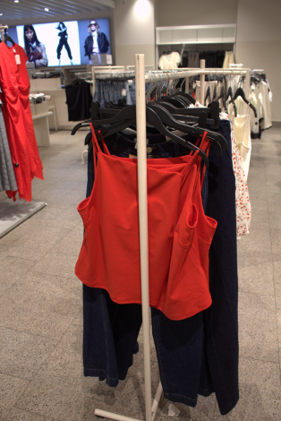
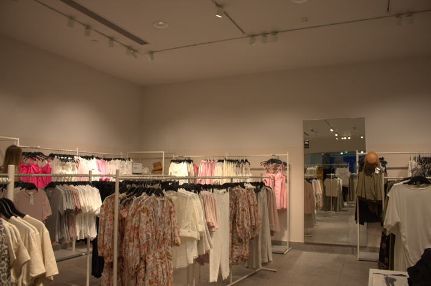
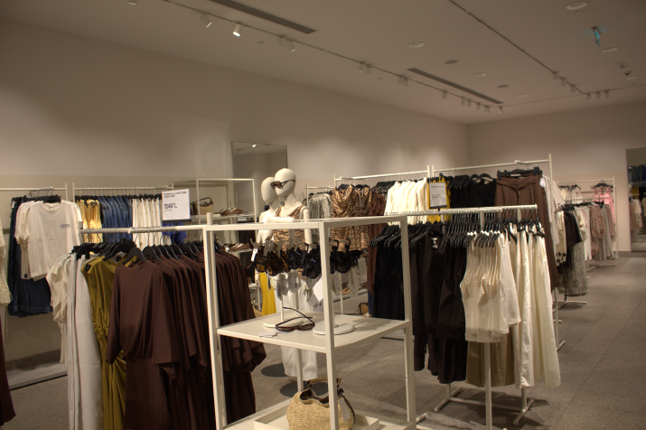
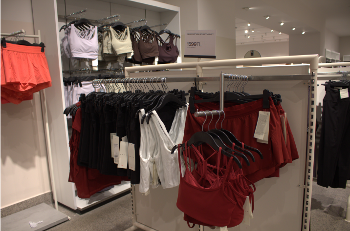
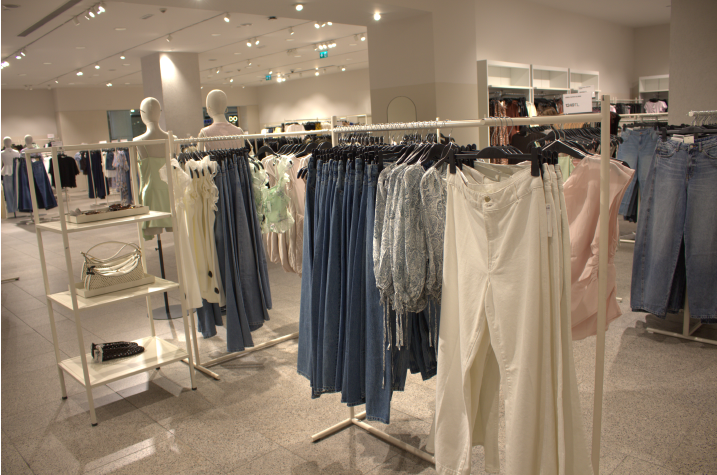

## ذهبت إلى إتش آند إم حتى لا تضطر للتخمين

لنكن صريحين — الصور على الإنترنت معدلة. الإضاءة مثالية، العارضات في أوضاع مثالية، وكل شيء يبدو خاليًا من العيوب. لكن كيف تبدو القطع *على الرف* في الواقع؟ والأهم، كيف تبدو عندما *تنسقينها* بنفسك؟

أمسكت بكاميراي، وذهبت إلى المتجر، والتقطت **10 صور حقيقية غير معدلة** للقطع التي أحببتها بالفعل. هذا هو دليلك الواقعي لما يستحق الشراء من متجر إتش آند إم الآن.

---

## مغامرتي في المتجر

عندما دخلت إتش آند إم، كنت في مهمة. أردت العثور على قطع متعددة الاستخدامات تناسب أسلوب حياتنا في الخليج — أقمشة قابلة للتنفس، تصاميم أنيقة، وقطع تنتقل بسهولة من النهار إلى الليل.

إليك لمحة عن أجواء المتجر والقطع التي لفتت انتباهي:


  
  
  
  
  
  
  
  
  
  


---

## تنسيق الفساتين مع الإكسسوارات المناسبة

الفستان هو مجرد فستان حتى تقومين بتنسيقه. قضيت وقتًا في قسم الإكسسوارات لأجمع حقائب وأحذية أنيقة مع فساتين مختلفة، والفرق كان *مذهلًا*.

**تنسيقي المفضل:**
- فستان ميدي منسدل بلون محايد
- مع حقيبة منظمة بمظهر الجلد المدبوغ
- وأحذية بكعب رفيع أو لوفرز سميكة

الحقيبة ترفع الإطلالة فورًا، والأحذية تربط كل شيء معًا. إنها النوعية من الإطلالات التي تجعل الناس يسألون، "من أين حصلتِ على هذا؟"

---

## مفاجأة الجودة: ملابس الاسترخاء والرياضة

يجب أن أعترف — لم أتوقع الكثير من قسم الملابس الرياضية. لكن بعد لمس الأقمشة والتحقق من الدرزات، انبهرت حقًا. القطن ناعم، البناطيل تجتاز اختبار القرفصاء (نعم، تحققت من ذلك)، وصدريات الرياضية توفر دعمًا حقيقيًا.

**أبرز المميزات:**
- أقمشة قابلة للتنفس مثالية لطقس الخليج
- درزات متينة تتحمل الغسيل المتكرر
- أسعار معقولة لا تكسر الميزانية
- تصاميم أنيقة تصلح للصالة الرياضية وخارجها

سواء كنتِ متجهة إلى النادي الرياضي أو لتسوق البقالة، هذه القطع مريحة، عالية الجودة، وتبدو رائعة بالفعل.

---

## لماذا تثقين بصوري؟

لقد التقطتها بنفسي — بدون فلاتر، بدون إضاءة احترافية، بدون حيل. ما ترينه هو بالضبط ما ستجدينه في المتجر. أردت أن أعطيكِ معاينة واقعية حتى تتمكني من التسوق بثقة عبر الإنترنت.

**ما ركزت عليه:**
- ✨ ملمس النسيج والألوان الفعلية
- ✨ كيف تبدو القطع على الرف
- ✨ تنسيقات ستايل تعمل بالفعل
- ✨ أجواء المتجر وأجوائه

---

## 🛍️ خصم 5% حصري لمتسوقي الخليج

التسوق أكثر متعة مع الخصم، أليس كذلك؟ لقد وفرت لكِ كوبون خصم حصري **5%**.

  
استخدمي هذا الرمز عند الدفع:

  
D8DN

  
صالح للحصول على <strong>خصم 5%</strong> على:

  

    <a href="https://ae.hm.com/en" target="_blank">🇦🇪 الإمارات</a> |
    <a href="https://sa.hm.com/en" target="_blank">🇸🇦 السعودية</a> |
    <a href="https://bh.hm.com/en" target="_blank">🇧🇭 البحرين</a> |
    <a href="https://kw.hm.com/en" target="_blank">🇰🇼 الكويت</a>
  

---

## الحكم النهائي: هل تشترين؟

**بكل تأكيد.** ولكن فقط إذا كنتِ تعرفين ما الذي تحصلين عليه — والآن أنتِ تعرفين.

التشكيلة الجديدة تحتوي على جواهر حقيقية. الأقمشة أفضل مما توقعت، المقاسات مناسبة، وإكسسوارات قوية. سواء كنتِ بحاجة إلى:
- فستان لمناسبة خاصة
- ملابس استرخاء مريحة لأيام العمل من المنزل
- ملابس رياضية عالية الجودة لتمارينك
- الحقيبة المثالية لإكمال إطلالتك

...إتش آند إم توفرها، وتبدو أفضل في الواقع.

---

## مستعدة للتسوق؟ ها هي دعوتك للعمل

لقد رأيتِ الصور. لديكِ نصائح التنسيق. والأهم، لديكِ **كوبون 5%**.

**توقفي عن التخمين وابدأي التسوق بثقة.**

<a href="https://ae.hm.com/en" target="_blank" class="cta-button">تسوقي الآن ووفرّي 5%</a>

لا تنسي استخدام الرمز **D8DN** عند الدفع قبل أن ينتهي!

---

*أي قطعة لفتت انتباهك؟ اتركي لي رسالة — أحب أن أعرف ما الذي تخططين لشرائه!*