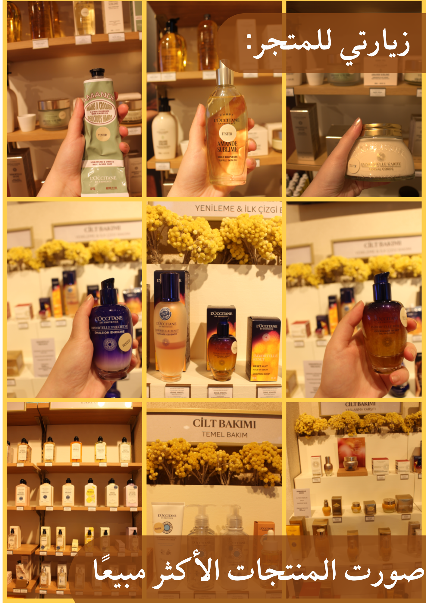

    

        هدية مجانية
        ✧ دليل العناية ✧
    

    

            
            
الاكثر مبيعًا

            
زيارة المتجر &amp; الأكثر مبيعًا

    <h1>دليل العناية بالبشرة على الطريقة الكورية مع L'Occitane</h1>
    

        
<strong>اكتشفي أسرار البشرة الزجاجية</strong>

        
دليلكِ الشامل لتطبيق تقنيات العناية الكورية باستخدام منتجات L'Occitane، مع روتينات مخصصة لعمر 30، 40، و50 سنة. حمّليه الآن واستفيدي من كود الخصم الحصري!

    

    <!-- زر تحميل PDF -->
    

        <a href="https://drive.google.com/uc?export=download&id=1w5e0FY7WlbBMPQSL682WXv8TbBTgSmO_" class="btn-download" download>
            ⬇️ تحميل الدليل الآن (PDF)
        </a>
        
ملف PDF · 9 صفحات · جاهز للطباعة

    

    

    <h2>✨ ماذا ستجدين في الدليل؟</h2>
    

        

            🧴
            <strong>10 خطوات كورية</strong>
            
روتين متكامل لبشرة زجاجية

        

        

            👩
            <strong>3 روتينات مخصصة</strong>
            
لعمر 30، 40، و50 سنة

        

        

            🌿
            <strong>المكونات النشطة</strong>
            
تعرفي على فوائد الخلود والشيا

        

        

            🏷️
            <strong>كود خصم 10%</strong>
            
استخدمي A162 في السعودية، الإمارات، الكويت

        

    

    <h2>📖 محتويات الدليل</h2>
    <ul>
        <li><strong>قاعدة العناية الكورية:</strong> 10 خطوات أساسية للبشرة الزجاجية.</li>
        <li><strong>روتين الثلاثين (30 سنة):</strong> أفضل 3 منتجات للحفاظ على الرطوبة والإشراقة.</li>
        <li><strong>روتين الأربعين (40 سنة):</strong> أفضل 3 منتجات للشد ومقاومة الترهل.</li>
        <li><strong>روتين الخمسين (50 سنة):</strong> أفضل 3 منتجات للعناية الفائقة والترطيب العميق.</li>
        <li><strong>ملحق المكونات:</strong> شرح مبسط لفوائد زيت الخلود، حمض الهيالورونيك، زبدة الشيا، ومستخلص الغاردينيا.</li>
    </ul>
    

        
🔑 كود الخصم الحصري

        
استخدمي الكود A162 للحصول على <strong>10% خصم</strong> على جميع منتجات L'Occitane عند الشراء من المواقع التالية:

        <ul style="list-style: none; padding-right: 0; display: flex; gap: 1.2rem; flex-wrap: wrap; margin-top: 0.5rem;">
            <li>🇸🇦 <a href="https://sa.loccitane.com" target="_blank" style="color: #b48b5a;">السعودية</a></li>
            <li>🇦🇪 <a href="https://ae.loccitane.com" target="_blank" style="color: #b48b5a;">الإمارات</a></li>
            <li>🇰🇼 <a href="https://kw.loccitane.com" target="_blank" style="color: #b48b5a;">الكويت</a></li>
        </ul>
    

    

        
لا تنتظري! حمّلي الدليل الآن وابدأي رحلة العناية ببشرتكِ.

        <a href="https://drive.google.com/uc?export=download&id=1w5e0FY7WlbBMPQSL682WXv8TbBTgSmO_" class="btn-download" download>
            ⬇️ تحميل الدليل (PDF)
        </a>
    

    

        ✧ أعددت هذا الدليل لكِ بعناية لتكون رحلتكِ نحو الجمال مميزة ✧
    

