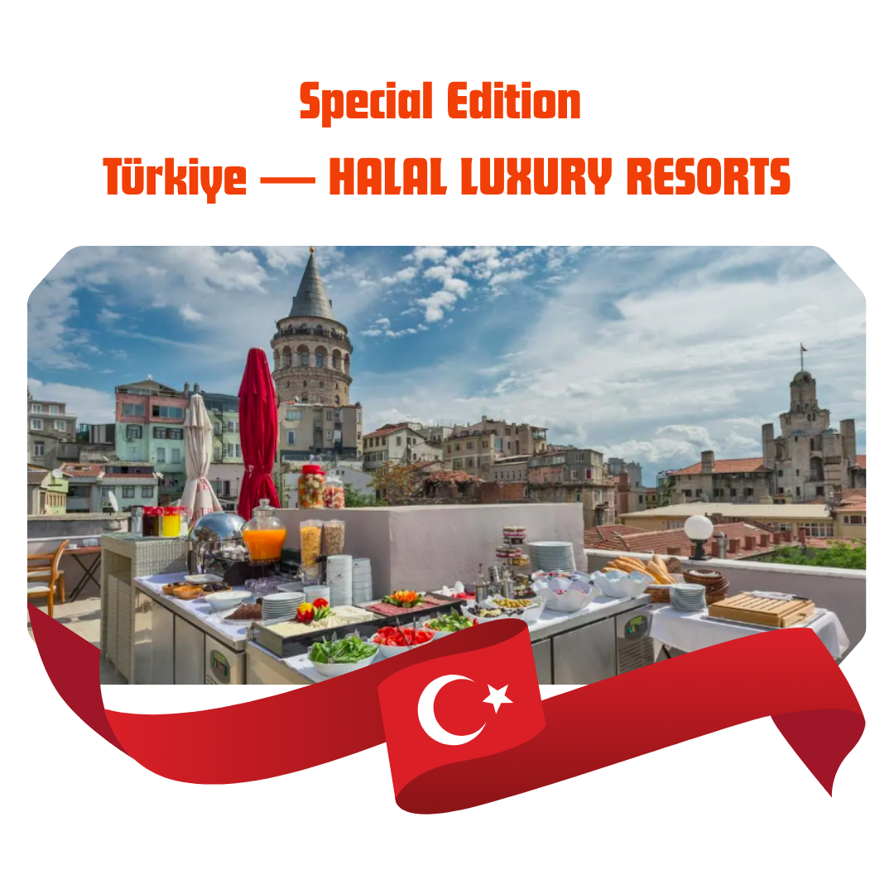
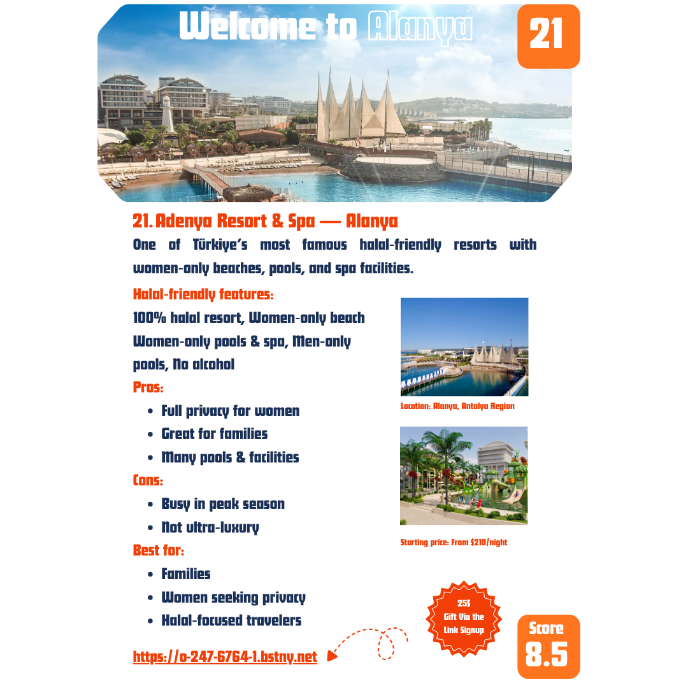

<!-- صورة المعاينة -->

  

<article>
  

    مرحباً بكم في <strong>دليلكم الأمثل للسفر الفاخر الحلال</strong>، المعد خصيصاً للمسافرين من دول مجلس التعاون الخليجي الذين يقدّرون الخصوصية، والراحة التي تراعي الشريعة الإسلامية، والتجارب الفاخرة.
    اخترنا لكم <strong>30 منتجعاً فاخراً</strong> في مختلف أنحاء الإمارات، قطر، عُمان، المملكة العربية السعودية، مصر، المغرب، جزر المالديف، ماليزيا، زنجبار، البوسنة، جورجيا، وقسم خاص بتركيا.
  

  

    تم اختيار كل منتجع بناءً على <strong>ميزات السياحة الحلال</strong>: مسابح مخصصة للنساء فقط، فيلات خاصة مع مسابح، عدم تقديم الكحول، مطاعم حلال، وخصوصية عائلية.
    سواء كنت تخطط لشهر عسل، أو عطلة عائلية، أو رحلة استجمام، يساعدك هذا الدليل في مقارنة الإيجابيات والسلبيات، الأسعار، والاستفادة من <strong>خصم 25% حصري لدول الخليج</strong> على الحجوزات التي تزيد عن 500 دولار.
  

  <!-- دعوة للتحميل -->
  

    <h3 style="color: #1a202c; font-weight: 700; margin-bottom: 0.75rem;">📥 حمل نسختك المجانية الآن</h3>
    

      تحميل الدليل الكامل المكون من 38 صفحة مع جميع المنتجعات الـ 30، التفاصيل الحلال، الأسعار، الخرائط، وروابط الحجز المباشرة.
    

    <a href="https://drive.google.com/file/d/1RVjs01dcU7DFHjkCh91XDYhRBADCv8aP/view?usp=sharing" 
       target="_blank" 
       rel="noopener noreferrer"
       style="display: inline-block; background: #2b6cb0; color: #fff; font-weight: 600; padding: 0.9rem 2.5rem; border-radius: 50px; text-decoration: none; font-size: 1.2rem; box-shadow: 0 4px 12px rgba(43,108,176,0.3); transition: all 0.2s;">
      تحميل الدليل مجاناً (PDF)
    </a>
    
لا حاجة لبريد إلكتروني • تحميل مباشر • 38 صفحة

  

  <!-- القسم 1: دول الخليج -->
  <h2 style="border-bottom: 4px solid #2b6cb0; padding-bottom: 0.5rem; margin-top: 3rem;">🌍 السعودية، الإمارات، قطر وعُمان</h2>
  

    
<strong>العلا</strong> – السعودية بيئة بلا كحول، فيلات خاصة، مناظر صحراوية. من 620$/ليلة.

    
<strong>نارسيوس أوبحر</strong> – جدة فيلات مع مسابح، سبا للنساء فقط، لا كحول. من 540$/ليلة.

    
<strong>أنانتارا النخلة</strong> – دبي فيلات فوق الماء، شاطئ خاص، سبا للنساء. من 520$/ليلة.

    
<strong>ذا كوف روتانا</strong> – رأس الخيمة فيلات مع مسابح، مناسب للعائلات، إطلالات بحيرة. من 260$/ليلة.

    
<strong>قصر السراب</strong> – أبوظبي فخامة صحراوية، مسابح خاصة، سبا للنساء. من 690$/ليلة.

    
<strong>المسيلة</strong> – الدوحة قصر فاخر، مركز صحي للنساء فقط، فيلات خاصة. من 430$/ليلة.

    
<strong>مرسى مالذ كمبينسكي</strong> – الدوحة شاطئ خاص، طعام حلال، مناسب للعائلات. من 350$/ليلة.

    
<strong>قصر البستان</strong> – مسقط قصر على الجرف، شاطئ خاص، لا لحم خنزير. من 390$/ليلة.

    
<strong>البليد صلالة</strong> – صلالة فيلات مع مسابح، خضرة استوائية، على الشاطئ. من 480$/ليلة.

  

  <!-- القسم 2: مصر والمغرب -->
  <h2 style="border-bottom: 4px solid #2b6cb0; padding-bottom: 0.5rem; margin-top: 3rem;">🇪🇬 مصر و 🇲🇦 المغرب</h2>
  

    
<strong>ريكسوس شرم الشيخ</strong> – مصر للبالغين فقط، شامل كلياً، طعام حلال. من 310$/ليلة.

    
<strong>جاز مكادي سرايا</strong> – الغردقة مناسب للعائلات، قيمة رائعة، طعام حلال. من 180$/ليلة.

    
<strong>سيرابان بوتيك</strong> – مراكش أجنحة مع مسابح خاصة، تصميم مغربي، هادئ. من 390$/ليلة.

    
<strong>رويال منصور</strong> – مراكش رياضات خاصة، فخامة فائقة، خدمة استثنائية. من 1500$/ليلة.

  

  <!-- القسم 3: المالديف، ماليزيا، زنجبار، البوسنة، جورجيا -->
  <h2 style="border-bottom: 4px solid #2b6cb0; padding-bottom: 0.5rem; margin-top: 3rem;">🏝️ المالديف • ماليزيا • زنجبار • البوسنة • جورجيا</h2>
  

    
<strong>صن سيام إيرو فوشي</strong> – المالديف فيلات فوق الماء، مسابح خاصة، طعام حلال. من 690$/ليلة.

    
<strong>أوزين بوليفوشي</strong> – المالديف فخامة فائقة، شامل كلياً، مسابح خاصة. من 1250$/ليلة.

    
<strong>ذا داتاي لنكاوي</strong> – ماليزيا غابات وشاطئ، طعام حلال، أجواء هادئة. من 420$/ليلة.

    
<strong>شانغريلا جولدن ساندز</strong> – بينانج شاطئ، جناح للبالغين، طابع تراثي. من 260$/ليلة.

    
<strong>ذا ريزيدنس زنجبار</strong> – تنزانيا فلل خاصة، مسابح خاصة، طعام حلال. من 480$/ليلة.

    
<strong>مالاك ريجنسي</strong> – البوسنة فندق حلال 100%، لا كحول، على البحيرة. من 140$/ليلة.

    
<strong>باراجراف ريزورت</strong> – جورجيا فخامة عصرية، مسبح أكواريوم، طعام حلال. من 310$/ليلة.

  

  <!-- القسم الخاص: تركيا (شبكة صور وصورتين معاينة) -->
  <h2 style="border-bottom: 4px solid #2b6cb0; padding-bottom: 0.5rem; margin-top: 3rem;">🇹🇷 إصدار خاص: تركيا – منتجعات فاخرة حلال</h2>
  
  <!-- صورتان معاينة من الدليل (قسم تركيا) -->
  

    

      
    

    

      
    

  

  <!-- شبكة منتجات تركيا -->
  

    
<strong>أدينيا</strong> – ألانيا منتجع حلال 100%، شاطئ وسبا للنساء فقط. من 210$/ليلة.

    
<strong>ووم ديلوكس</strong> – ألانيا شاطئ للنساء فقط، لا كحول، طعام حلال. من 240$/ليلة.

    
<strong>ساريالر الحديثة</strong> – ألانيا مسابح للنساء/للرجال، حلال بأسعار معقولة. من 160$/ليلة.

    
<strong>أنجيلز مارماريس</strong> – مارماريس فخامة فائقة، فيلات خاصة، شاطئ للنساء. من 650$/ليلة.

    
<strong>بوف أولوداغ</strong> – بورصة منتجع شتوي، سبا للنساء، عائلي. من 190$/ليلة.

    
<strong>إن جي سابانجا</strong> – سابانجا غابات، سبا للنساء، استجمام. من 260$/ليلة.

    
<strong>سيرا ليك</strong> – طرابزون إطلالات بحيرة، لا كحول، عائلي. من 120$/ليلة.

    
<strong>أيدر هاشم أوغلو</strong> – ريزي منتجع جبلي، طبيعة، طعام حلال. من 110$/ليلة.

    
<strong>أجوا سلطان أحمد</strong> – إسطنبول فندق حلال 5 نجوم، تصميم عثماني، لا كحول. من 350$/ليلة.

    
<strong>جالاتاور</strong> – إسطنبول فندق عصري، طعام حلال، قرب برج غلطة. من 120–180$/ليلة.

  

  <!-- الخاتمة ودعوة التحميل النهائية -->
  

    <h3 style="color: #f7fafc; font-size: 2rem; font-weight: 700; letter-spacing: -0.5px;">30 منتجعاً. خصوصية لا مثيل لها. مزايا حصرية لدول الخليج.</h3>
    

      من فيلات المسابح الخاصة في المالديف، إلى الشواطئ المخصصة للنساء في تركيا، والقصور الصحراوية في الإمارات، والمنتجعات الفاخرة في المغرب، ماليزيا، زنجبار، وغيرها.
    

    

      

        <strong>مزاياك الحصرية في دول الخليج:</strong> رصيد 25$ بعد التسجيل • لا حاجة لكود ترويجي • يطبق تلقائياً على حجوزات 500$+ • يعمل في جميع المنتجعات المذكورة.
      

    

    <a href="https://drive.google.com/file/d/1RVjs01dcU7DFHjkCh91XDYhRBADCv8aP/view?usp=sharing" 
       target="_blank" 
       rel="noopener noreferrer"
       style="display: inline-block; background: #48bb78; color: #1a202c; font-weight: 700; padding: 1rem 3rem; border-radius: 50px; font-size: 1.3rem; text-decoration: none; margin-top: 0.5rem; box-shadow: 0 6px 14px rgba(72,187,120,0.3);">
      📥 تحميل الدليل الكامل الآن
    </a>
    

      يشمل جميع المنتجعات الـ 30، التفاصيل الحلال، الأسعار، الخرائط، وروابط الحجز المباشرة.
    

  

  

    <em>تصميم الملف: نعمة السيد • مدعوم من HalalBooking • الأسعار تقريبية وتخضع للموسم.</em>
  

</article>