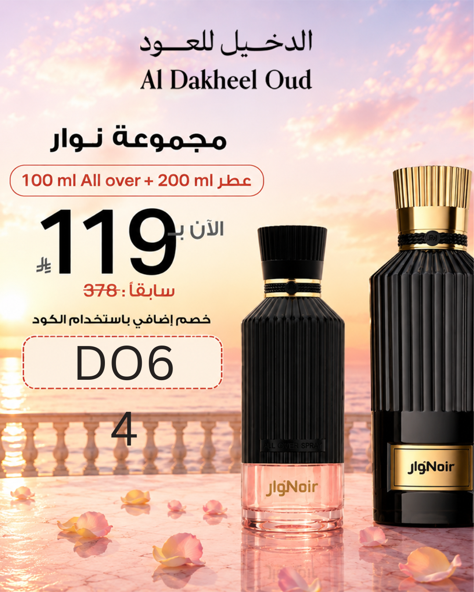

<!-- 
  ملاحظة: هذا القالب مصمم لـ Hugo مع واجهة برمجة تطبيقات الصور.
  الصور النائبة: استبدل الرابط "https://via.placeholder.com/..." بصورك الفعلية.
  تم إدراج مسار الصور في Front Matter كـ "image" لاستخدامها في المعاينة.
-->

<!DOCTYPE html>
<html lang="ar" dir="rtl">
<head>
  <meta charset="UTF-8">
  <meta name="viewport" content="width=device-width, initial-scale=1.0">
  <title>عرض الصيف - ثلاثية الدخيل للعود</title>
  
</head>
<body>

  <!-- ====== صورة المعاينة (البانر) ====== -->
  

    <!-- استبدل الرابط التالي بصورة المعاينة الفعلية -->
    
  

  <!-- ====== المحتوى الرئيسي ====== -->
  <h1>اكتشف ثلاثية الصيف الفاخرة من الدخيل للعود</h1>
  
أوسكار الذهبي · أوسكار الفضي · نوار – بسعر صيفي لا يُصدَّق

  
في موسم الصيف، تبحث عن عطور تمنحك الانتعاش والتميز والجاذبية. وتأتيكم <strong>الدخيل للعود</strong> بعرض استثنائي لفترة محدودة جداً على مجموعتها الفاخرة، كل منها بحجم <strong>200 مل</strong> مع <strong>أوفر أول 100 مل</strong> إضافي – وبسعر خيالي لا يُعوّض!

  

    <strong>🎉 عرض الصيف المحدود:</strong> لفترة محدودة جداً وبمناسبة الصيف، تقدم لكم الدخيل للعود المجموعة الكاملة (بخاخ 200 مل + أوفر أول 100 مل) بسعر واحد لا يُصدق: 
    119 ر.س 
    (شامل الضريبة)
  

  <!-- ====== العطر الأول ====== -->
  <h2>☀️ أوسكار الذهبي</h2>
  
<strong>“عبير الأزهار المائية المنعشة لفصلي الربيع والصيف”</strong>

  
انطلق في رحلة عطرية منعشة تأخذك إلى شواطئ المحيط وسط حقول الأزهار المتفتحة.

  <ul>
    <li><strong>🌊 مقدمة العطر:</strong> اليوسفي الحلو ورائحة المحيط.</li>
    <li><strong>🌸 قلب العطر:</strong> زهرة اللوتس المائية مع الورد الدمشقي.</li>
    <li><strong>🍬 قاعدة العطر:</strong> قاعدة سويتية حلوة دافئة.</li>
  </ul>

  <!-- ====== العطر الثاني ====== -->
  <h2>☕ أوسكار الفضي</h2>
  
<strong>“صمم خصيصاً لعشاق رائحة القهوة الممزوجة بالفانيلا والباتشولي”</strong>

  
عطر جريء ودافئ، يمنحك حضوراً آسراً لا يزول، مستوحى من سحر القهوة مع لمسات خشبية فاخرة.

  <ul>
    <li><strong>☕ مقدمة العطر:</strong> القهوة مع لمسة سويت حلوة.</li>
    <li><strong>🍐 قلب العطر:</strong> زهر البرتقال، الكمثرى، والفلفل الوردي.</li>
    <li><strong>🌲 قاعدة العطر:</strong> الفانيليا، الباتشولي، وخشب السيدار (الأرز).</li>
  </ul>

  <!-- ====== العطر الثالث ====== -->
  <h2>🌶️ نوار</h2>
  
<strong>“الحمضيات المنعشة تجتمع مع التوابل والأخشاب الدافئة”</strong>

  
مجموعة متكاملة تضم منتجين، تمنحك تجربة عطرية غنية ومتوازنة بين الانتعاش والدفق الشرقي.

  <ul>
    <li><strong>🍋 مقدمة العطر:</strong> الحمضيات المنعشة (كالبرتقال والليمون).</li>
    <li><strong>🌶️ قلب العطر:</strong> التوابل الشرقية العطرية (كالقرفة والهيل).</li>
    <li><strong>🪵 قاعدة العطر:</strong> الأخشاب الدافئة التي تمنح العطر ثباتاً فخماً.</li>
  </ul>

  <!-- ====== صور العطور الثلاث ====== -->
  <h2 style="margin-top: 2.8rem; width: 100%;">✨ اختر توقيعك العطري</h2>
  

    <!-- بطاقة العطر 1: أوسكار الذهبي -->
    

      

        <!-- استبدل الرابط بصورة أوسكار الذهبي -->
        
      

      

        <h4>أوسكار الذهبي</h4>
        
انتعاش مائي وزهور

        يوسفي
        لوتس
        ورد دمشقي
      

    

    <!-- بطاقة العطر 2: أوسكار الفضي -->
    

      

        <!-- استبدل الرابط بصورة أوسكار الفضي -->
        
      

      

        <h4>أوسكار الفضي</h4>
        
قهوة وفانيليا وأخشاب

        قهوة
        فانيليا
        أرز
      

    

    <!-- بطاقة العطر 3: نوار -->
    

      

        <!-- استبدل الرابط بصورة نوار -->
        
      

      

        <h4>نوار</h4>
        
حمضيات وتوابل وأخشاب

        حمضيات
        توابل شرقية
        أخشاب دافئة
      

    

  

  <!-- ====== كود الخصم ====== -->
  

    <strong style="color: var(--color-accent);">🔥 خصم إضافي 5%</strong> 
    احصل على خصم <strong>5% إضافي</strong> عند استخدام كود الخصم الحصري: 
    
DO64
 
    أدخل الكود في صفحة الدفع واستمتع بالخصم الإضافي فوراً!
  

  <!-- ====== زر الدعوة ====== -->
  

    <a href="https://sa.aldakheeloud.com/ar" target="_blank" class="btn-cta">
      🛒 اطلب الآن
      <small>العرض لفترة محدودة – الكميات محدودة</small>
    </a>
  

  

    سواء كنت من عشاق الانتعاش المائي، أو دفء القهوة، أو العبق الشرقي، هناك عطر ينتظرك بسعر لا يُقاوم.
  

  

    🌟 اختار أناقتك هذا الصيف مع الدخيل للعود – ودع عطرك يتحدث عنك دون كلام!
  

<!-- نهاية .article-container -->

</body>
</html>