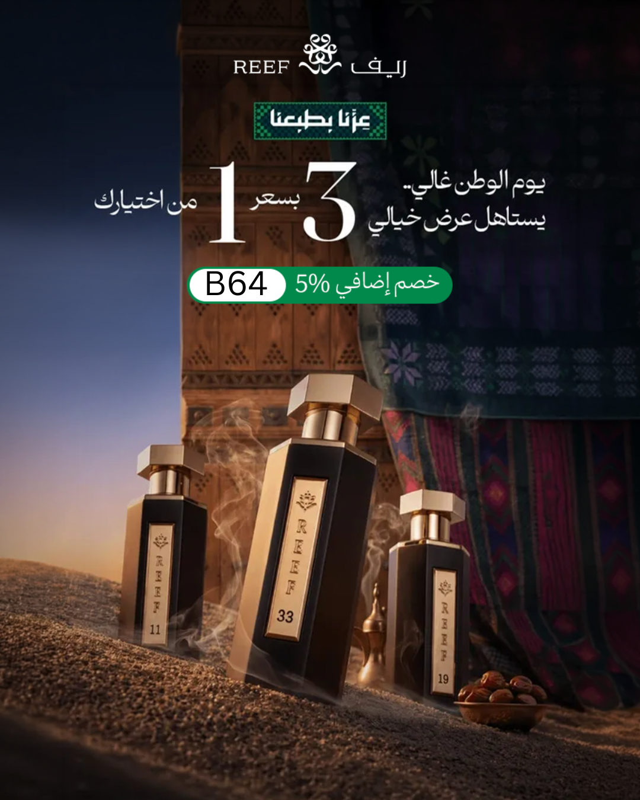

<!DOCTYPE html>
<html lang="ar" dir="rtl">
<head>
    <meta charset="UTF-8">
    <meta name="viewport" content="width=device-width, initial-scale=1.0">
    <title>عرض ريف الوطنية - 3 عطور بسعر عطر واحد</title>
    <link href="https://fonts.googleapis.com/css2?family=Playfair+Display:ital,wght@0,400;0,700;0,900;1,400&family=Tajawal:wght@300;400;700;900&display=swap" rel="stylesheet">
    
</head>
<body>
    

        <!-- Banner with Featured Image -->
        <!-- Replace the src with your actual image path if using a real image -->
        
        

        <!-- Header -->
        

            <h1>🇸🇦 عيد وطن 🇸🇦</h1>
            <h2>عرض ريف الوطنية الاستثنائي</h2>
        

        <!-- Quote -->
        

            

                "الوطن هو الذكريات التي نصنعها معًا، ورائحة العطر هي أجمل ما يختبئ في الذاكرة."
            

            

                — في يوم التأسيس، تتحد الروائح لتخلد الفرح
            

        

        <!-- Introduction -->
        

            

                بينما نحتفل <strong>بيوم التأسيس السعودي</strong>، يوم الفخر والوحدة والانتماء، لا يوجد وقت أفضل للانغماس في أرقى العطور التي تجمع بين الأصالة والأناقة. في هذه المناسبة الوطنية العظيمة، تقدم لكم <strong>ريف</strong> (Reef) أروع عطورها مع عرض يعكس روح الكرم والعطاء.
            

            

                يُعد يوم التأسيس فرصة مثالية لتجديد مجموعة عطورك أو اختيار هدية مميزة لأحبائك. مع تجمع العائلات وبهجة الاحتفالات، يضيف العطر الفاخر لمسة سحرية لكل لحظة. <strong>اغتنم هذه المناسبة السعيدة</strong> لتحصل على أفضل العطور بقيمة استثنائية — لأن الاحتفال بوطنك يستحق مكافآت تليق بعظمته.
            

        

        <!-- Perfumes -->
        

            <h3>✨ الثلاثي الملكي ✨</h3>
            <!-- Perfume 1 -->
            

                <h4>
                    👑 ريف برينسيس
                    المفضل لدي
                </h4>
                

                    المكونات: ياسمين، ورد، عنبر، وفانيليا
                

                

                    باقة ملكية تعكس جوهر الليالي العربية — زهرية، دافئة، وأنيقة بلا حدود. <strong>عطري الشخصي المفضل</strong> لما يمنحه من إحساس بالخلود والأنوثة الراقية.
                

            

            <!-- Perfume 2 -->
            

                <h4>
                    🤍 ريف 33 وايت
                </h4>
                

                    المكونات: مسك أبيض، أوريس بودري، وأخشاب ناعمة
                

                

                    نقي، منعش، ومشرق. هذا العطر هو تجسيد البدايات الجديدة — مثالي لتفاؤل يوم التأسيس وروحه المتجددة.
                

            

            <!-- Perfume 3 -->
            

                <h4>
                    💜 فيوليت مسك
                </h4>
                

                    المكونات: بنفسج، مسك، باتشولي، ولمسات بودرية
                

                

                    مزيج آسر من الزهور البودرية والمسك العميق — غامض، جذاب، ولا يُنسى. يعكس شخصية قوية واثقة.
                

            

        

        <!-- Offer Box -->
        

            
🎉 3 عطور بسعر عطر واحد 🎉

            
+ خصم إضافي <strong>5%</strong> عند استخدام الكود:

            
B64

            

                🇸🇦 عرض محدود — احتفل بيوم التأسيس بأناقة 🇸🇦
            

        

        <!-- Footer -->
        

            

                🛍️ تسوق الآن ودع الاحتفال يبدأ
            

            

                ريف — عطر يروي قصة وطن
            

        

    

    

</body>
</html>