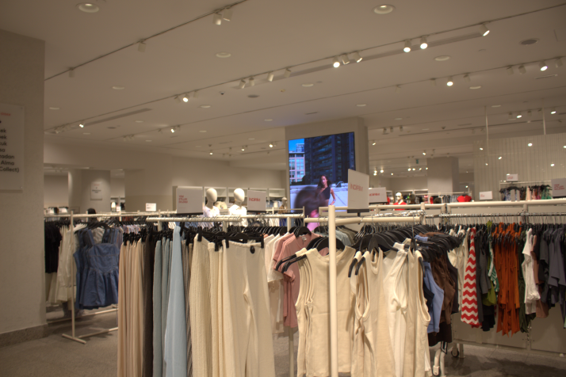
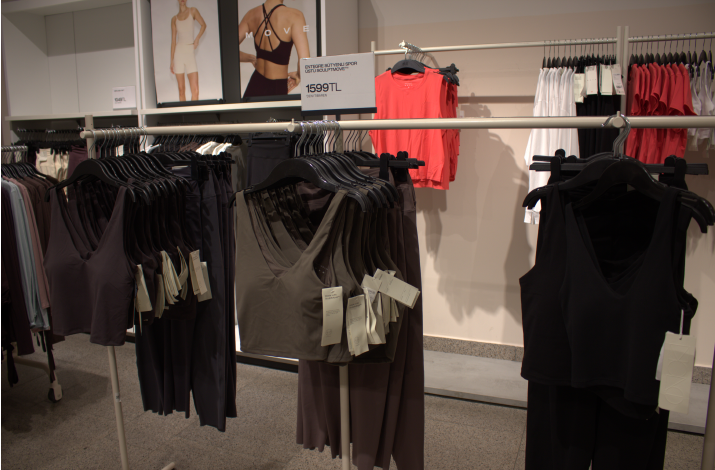

## I Went to H&M So You Don't Have To Guess

Let's be real — online photos are edited. The lighting is perfect, the models are posed, and everything looks flawless. But what does it actually look like *on the rack*? And more importantly, how does it look when *you* style it?

I grabbed my camera, visited the store, and shot **10 real, unedited photos** of the pieces I actually liked. This is your no-BS guide to what's worth buying right now in the H&M store.

---

## My In-Store Adventure

Walking into H&M, I was on a mission. I wanted to find versatile pieces that work for our lifestyle in the Gulf — breathable fabrics, elegant silhouettes, and items that transition from day to night.

Here's a glimpse of the store vibe and the pieces that caught my eye:


  
  
  
  
  
  
  
  
  
  


---

## Pairing Dresses with the Right Accessories

Here's the thing — a dress is just a dress until you style it. I spent time in the accessories section pairing elegant bags and shoes with different dresses, and the difference is *insane*.

**My favorite combo:**
- A flowy midi dress in a neutral tone
- Paired with a structured leather-look bag
- Finished with strappy heels or chunky loafers

The bag instantly elevates the outfit, and the shoes tie everything together. It's the kind of look that makes people ask, "Where did you get that?"

---

## The Quality Surprise: Loungewear & Sportswear

I have to admit — I didn't expect much from the sportswear section. But after touching the fabrics and checking the seams, I was genuinely impressed. The cotton is soft, the leggings pass the squat test (yes, I checked), and the sports bras actually offer support.

**Highlights:**
- Breathable fabrics perfect for Gulf weather
- Durable stitching that survives multiple washes
- Affordable prices that won't break the bank
- Stylish designs that work both in and out of the gym

Whether you're heading to the gym or just running errands, these pieces are comfortable, high-quality, and actually look good.

---

## Why You Should Trust My Photos

I shot these myself — no filters, no professional lighting, no tricks. What you see is exactly what you'll find in-store. I wanted to give you a realistic preview so you can shop with confidence online.

**Here's what I focused on:**
- ✨ Actual fabric texture and colors
- ✨ How pieces look on the rack
- ✨ Styling combinations that work
- ✨ The vibe and atmosphere of the store

---

## 🛍️ Exclusive 5% Off for Gulf Shoppers

Shopping is more fun with a discount, right? I've got you covered with an exclusive **5% off** coupon.

  
Use this code at checkout:

  
D8DN

  
Valid for <strong>5% off</strong> on:

  

    <a href="https://ae.hm.com/en" target="_blank">🇦🇪 UAE</a> |
    <a href="https://sa.hm.com/en" target="_blank">🇸🇦 Saudi</a> |
    <a href="https://bh.hm.com/en" target="_blank">🇧🇭 Bahrain</a> |
    <a href="https://kw.hm.com/en" target="_blank">🇰🇼 Kuwait</a>
  

---

## The Final Verdict: Should You Buy?

**Absolutely.** But only if you know what you're getting — and now you do.

The new collection has some real gems. The fabrics are better than I expected, the fits are flattering, and the accessories game is strong. Whether you need:
- A dress for a special occasion
- Comfortable loungewear for WFH days
- Quality sportswear for your workouts
- The perfect bag to complete your look

...H&M has it, and it looks even better in person.

---

## Ready to Shop? Here's Your Call to Action

You've seen the photos. You have the styling tips. And most importantly, you have the **5% off coupon**.

**Stop guessing and start shopping with confidence.**

<a href="https://ae.hm.com/en" target="_blank" class="cta-button">Shop Now & Save 5%</a>

Don't forget to use code **D8DN** at checkout before it expires!

---

*Which piece caught your eye? Drop a comment below — I'd love to know what you're planning to buy!*