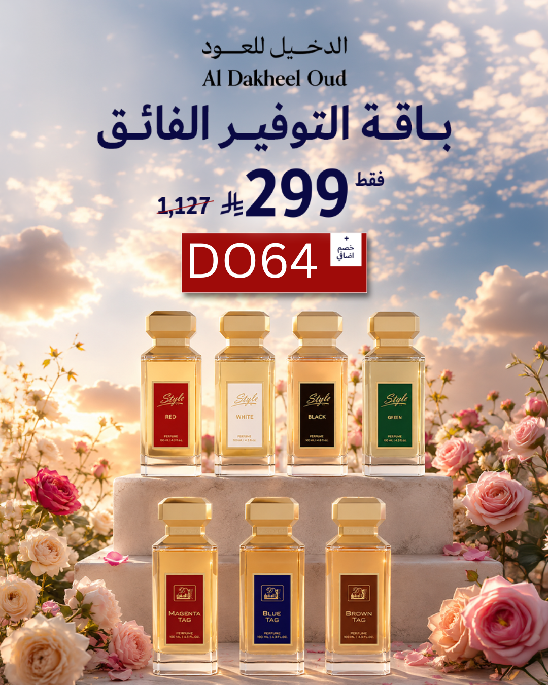
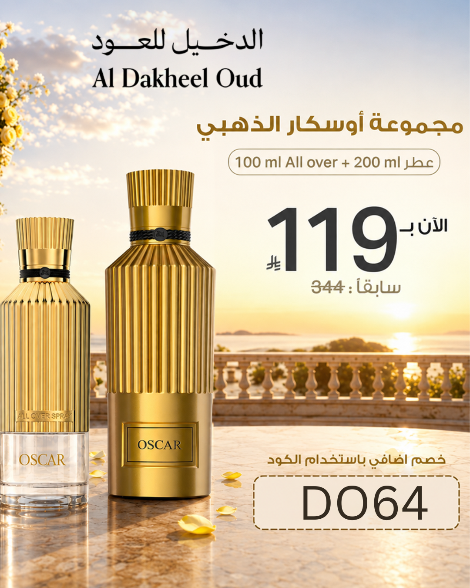
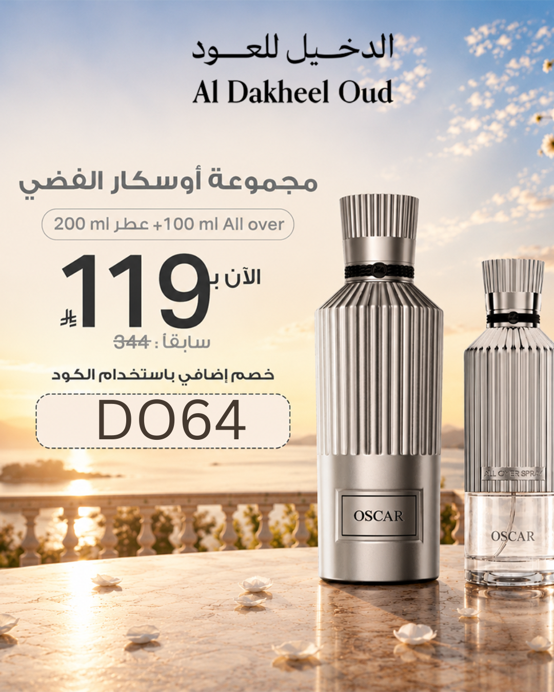

<!-- 
  Note: This template is designed for Hugo with an image API.
  Placeholder images: Replace the "images/..." paths with your actual images.
  The image path in Front Matter is set as "image" for preview purposes.
-->

<!DOCTYPE html>
<html lang="en">
<head>
  <meta charset="UTF-8">
  <meta name="viewport" content="width=device-width, initial-scale=1.0">
  <title>Summer Offer - Al Dakheel Oud Trilogy</title>
  
</head>
<body>

  <!-- ====== Featured Image (Banner) ====== -->
  

    <!-- Replace the following link with your actual preview image -->
    
  

  <!-- ====== Main Content ====== -->
  <h1>Discover the Luxury Summer Trilogy from Al Dakheel Oud</h1>
  
Oscar Gold · Oscar Silver · Nawwar – at an Unbelievably Low Summer Price

  
In the summer season, you seek fragrances that give you freshness, distinction, and allure. <strong>Al Dakheel Oud</strong> brings you an exceptional, limited-time offer on its luxury collection, each in a <strong>200 ml</strong> spray with an additional <strong>100 ml Over First</strong> – at a price that's simply irresistible!

  

    <strong>🎉 Limited Summer Offer:</strong> For a very limited time and to celebrate summer, Al Dakheel Oud offers you the complete set (200 ml spray + 100 ml Over First) at one incredible price: 
    119 SAR 
    (VAT included)
  

  <!-- ====== First Perfume ====== -->
  <h2>☀️ Oscar Gold</h2>
  
<strong>"The refreshing aquatic floral scent for spring and summer"</strong>

  
Embark on a refreshing fragrance journey that takes you to ocean shores amidst blooming flower fields.

  <ul>
    <li><strong>🌊 Top Notes:</strong> Sweet Mandarin & Oceanic Breeze.</li>
    <li><strong>🌸 Heart Notes:</strong> Water Lotus & Damask Rose.</li>
    <li><strong>🍬 Base Notes:</strong> Sweet Gourmand Accord.</li>
  </ul>

  <!-- ====== Second Perfume ====== -->
  <h2>☕ Oscar Silver</h2>
  
<strong>"Designed for lovers of coffee blended with vanilla and patchouli"</strong>

  
A bold and warm fragrance that gives you a captivating presence that lingers, inspired by the magic of coffee with luxurious woody touches.

  <ul>
    <li><strong>☕ Top Notes:</strong> Coffee with a sweet gourmand twist.</li>
    <li><strong>🍐 Heart Notes:</strong> Orange Blossom, Pear, & Pink Pepper.</li>
    <li><strong>🌲 Base Notes:</strong> Vanilla, Patchouli, & Cedarwood.</li>
  </ul>

  <!-- ====== Third Perfume ====== -->
  <h2>🌶️ Nawwar</h2>
  
<strong>"Refreshing citrus meets oriental spices and warm woods"</strong>

  
A complete set with two products, offering you a rich and balanced fragrance experience between freshness and oriental warmth.

  <ul>
    <li><strong>🍋 Top Notes:</strong> Refreshing Citrus (Orange & Lemon).</li>
    <li><strong>🌶️ Heart Notes:</strong> Oriental Spices (Cinnamon & Cardamom).</li>
    <li><strong>🪵 Base Notes:</strong> Warm Woods for a luxurious, long-lasting finish.</li>
  </ul>

  <!-- ====== Three Perfume Images ====== -->
  <h2 style="margin-top: 2.8rem; width: 100%;">✨ Choose Your Signature Scent</h2>
  

    <!-- Perfume Card 1: Oscar Gold -->
    

      

        <!-- Replace with your Oscar Gold image -->
        
      

      

        <h4>Oscar Gold</h4>
        
Aquatic & Floral Freshness

        Mandarin
        Lotus
        Damask Rose
      

    

    <!-- Perfume Card 2: Oscar Silver -->
    

      

        <!-- Replace with your Oscar Silver image -->
        
      

      

        <h4>Oscar Silver</h4>
        
Coffee, Vanilla & Woods

        Coffee
        Vanilla
        Cedar
      

    

    <!-- Perfume Card 3: Nawwar -->
    

      

        <!-- Replace with your Nawwar image -->
        
      

      

        <h4>Nawwar</h4>
        
Citrus, Spices & Woods

        Citrus
        Oriental Spices
        Warm Woods
      

    

  

  <!-- ====== Discount Code ====== -->
  

    <strong style="color: var(--color-accent);">🔥 Extra 5% Off</strong> 
    Get an <strong>extra 5% discount</strong> when you use the exclusive promo code: 
    
DO64
 
    Enter the code at checkout and enjoy the extra discount instantly!
  

  <!-- ====== Call to Action ====== -->
  

    <a href="https://sa.aldakheeloud.com/ar" target="_blank" class="btn-cta">
      🛒 Order Now
      <small>Limited-time offer – limited stock available</small>
    </a>
  

  

    Whether you're a fan of aquatic freshness, warm coffee, or oriental allure, there's a fragrance waiting for you at an unbeatable price.
  

  

    🌟 Choose your summer elegance with Al Dakheel Oud – and let your fragrance speak for you!
  

<!-- End .article-container -->

</body>
</html>