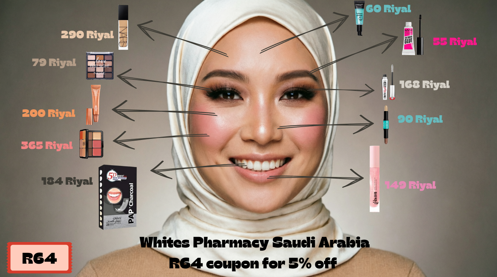

> How to achieve this look is explained in detail in the article below.

  
Extra 5% Off 🎁

  
Use discount code <strong>R64</strong> at checkout from Whites Pharmacy.

  
<a href="https://www.whites.sa" target="_blank" rel="noopener noreferrer" style="display: inline-block; background: #7c4dff; color: white; text-decoration: none; padding: 10px 16px; border-radius: 8px; font-weight: 600;">Shop Now</a>

As the new school year approaches, it's time to refresh your look and highlight your natural beauty with the latest and best products. **Whites Pharmacy** in Saudi Arabia offers a curated selection of premium cosmetics to help you achieve a complete, long-lasting look.

Take advantage of **Back to School discounts** now, and save even more with the **exclusive promo code "R64"** for an **extra 5% off** your entire purchase.

---

## 🛒 Recommended Products for the Complete Look:

### 1. The Perfect Primer for Makeup Hold
**e.l.f. Power Grip Primer Clear**  
The first step to any successful makeup look is the primer. This primer acts like a strong magnet for makeup, thanks to its sticky gel formula that grips your foundation and keeps your makeup in place for hours without smudging, while instantly hydrating your skin.

**Product Link:** [https://www.whites.sa/en-sa/elf-power-grip-primer-clear/](https://www.whites.sa/en-sa/elf-power-grip-primer-clear/)

---

### 2. Natural Radiance Foundation
**NARS Natural Radiant Foundation**  
For glowing, luminous skin, choose the NARS foundation. It provides buildable medium-to-full coverage with a lightweight texture that brightens and evens out your complexion all day long. Suitable for normal to dry skin thanks to its hydrating formula.

**Product Link:** [https://www.whites.sa/en-sa/nars-natural-radiant-foundation/](https://www.whites.sa/en-sa/nars-natural-radiant-foundation/)

---

### 3. All-in-One Concealer & Contour Palette
**Make Up For Ever HD Skin All-in-One Face Palette Harmony 2**  
A complete palette combining high-coverage concealer, contour, highlighter, and blush in shades that harmonize with your skin tone. Perfect for correcting imperfections, reshaping, and illuminating areas of your face with a professional, easy touch.

**Product Link:** [https://www.whites.sa/en-sa/make-up-forever-hd-skin-all-in-one-face-palette-harmony-2/](https://www.whites.sa/en-sa/make-up-forever-hd-skin-all-in-one-face-palette-harmony-2/)

---

### 4. Dual-Action Shaping & Contouring Stick
**NYX Wonder Stick Face Shaping Contouring Stick**  
A magical dual-ended stick to easily define and contour your facial features. The dark end is for contouring under cheekbones, along the sides of the nose, and jawline, while the light end (highlighter) adds a natural glow to cheekbones and the bridge of the nose. Its creamy formula blends seamlessly into the skin.

**Product Link:** [https://www.whites.sa/en-sa/nyx-wonder-stick-face-shaping-contouring-stick/](https://www.whites.sa/en-sa/nyx-wonder-stick-face-shaping-contouring-stick/)

---

### 5. Charlotte Tilbury Glowgasm Beauty Light Wand
**Charlotte Tilbury Glowgasm Beauty Light Wand**  
For a final touch of radiance and glow, use the Charlotte Tilbury Light Wand. It gives a natural, captivating luminosity to cheekbones, under the brow, and in the inner corners of the eyes, thanks to its lightweight, blendable liquid formula.

**Product Link:** [https://www.whites.sa/en-sa/charlotte-tilbury-glowgasm-beauty-light-wand/](https://www.whites.sa/en-sa/charlotte-tilbury-glowgasm-beauty-light-wand/)

---

### 6. Brow Glue for Perfectly Groomed Brows
**NYX The Brow Glue**  
Achieve perfect brows with a smooth, flake-free "laminated" look. This clear brow glue locks hairs in place all day, giving them a fuller, groomed appearance without feeling stiff or crunchy.

**Product Link:** [https://www.whites.sa/en-sa/nyx-the-brow-glue/](https://www.whites.sa/en-sa/nyx-the-brow-glue/)

---

### 7. Benefit Mascara for Thick, Dramatic Lashes
**Benefit They're Real! Magnet Mascara Black**  
Add a dramatic touch to your look with Benefit mascara, which gives your lashes incredible length and volume thanks to magnetic technology that attracts fibers to the lashes. Long-lasting and clump-free.

**Product Link:** [https://www.whites.sa/en-sa/benefit-they-re-real-magnet-mascara-black/](https://www.whites.sa/en-sa/benefit-they-re-real-magnet-mascara-black/)

---

### 8. Gisou Hydrating Lip Oil
**Gisou Lip Moisturizing Oil**  
A final touch of shine and hydration for supple lips. Gisou Lip Oil nourishes lips with honey oil, known for its moisturizing and antioxidant properties, giving them a healthy, glossy look that lasts.

**Product Link:** [https://www.whites.sa/en-sa/gisou-lip-moisturizing-oil/](https://www.whites.sa/en-sa/gisou-lip-moisturizing-oil/)

---

### 9. A Bright Smile with Teeth Whitening Strips
**5D White 5D Teeth Whitening Strips Charcoal 28**  
Complete your look with a bright, white smile. 5D White strips with activated charcoal effectively remove stains from coffee and tea in just a few uses, with a safe formula that minimizes tooth sensitivity.

**Product Link:** [https://www.whites.sa/en-sa/5d-white-5d-teeth-whitening-strips-charcoal-28/](https://www.whites.sa/en-sa/5d-white-5d-teeth-whitening-strips-charcoal-28/)

---

## 💡 Steps to Achieve the Complete Look:

1.  **Prep Your Skin:** Start with moisturizing your skin, then apply **e.l.f. Primer** all over your face to ensure long-lasting makeup.
2.  **Even Out Your Complexion:** Use a sponge or brush to apply **NARS Foundation** for an even, radiant complexion.
3.  **Correct & Highlight:** Using the **Make Up For Ever HD Palette**, correct dark circles and imperfections, then apply highlights and contour.
4.  **Contour Your Face:** Apply the **NYX Wonder Stick** to your desired contour areas and blend well for defined features.
5.  **Add a Magical Glow:** Apply the **Charlotte Tilbury** wand to the highest points of your cheekbones and the bridge of your nose for a natural radiance.
6.  **Eyes & Brows:** Set your brows with **NYX Brow Glue** and apply **Benefit Mascara** to your lashes for density and length.
7.  **Finishing Touches:** Hydrate your lips with **Gisou Lip Oil**, and don't forget to use **5D White** strips in your daily routine to maintain a sparkling smile.

---

## 🎁 Don't Miss Out!

Take advantage of the exclusive **Back to School discounts** at Whites Pharmacy and get an **extra 5% off** when you use promo code **R64** at checkout.

**How to Use the Code:**
1.  Add your favorite products to the shopping cart.
2.  At checkout, enter the code **R64** in the "Discount Code" box.
3.  Enjoy an instant extra 5% off your entire order!

> *Offers are valid for a limited time and while stocks last. Get ready for the new school year with your best look yet.*

---