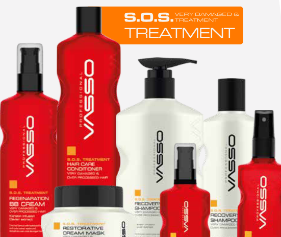
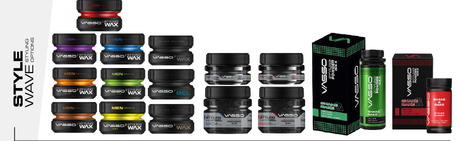


    

    <!-- TITLE & META -->
    <h1>Vasso by Organika: Sertifikalı, Canlı ve Gençlik Dolu Güzellik ve Bakım Çözümleri Körfez Pazarı İçin</h1>

    

        Temmuz 2026
        ✦ Canlı &amp; Gençlik Dolu
        Körfez Pazarı Odağı
        CPNP &amp; FDA Sertifikalı
    

    <!-- LEAD -->
    

        <strong>Vasso by Organika</strong>, Körfez pazarındaki distribütörler, salon sahipleri ve perakendeciler için ürün performansı, düzenleyici güvence ve premium sunumu bir araya getiriyor. Marka, kapılarından giren her müşteriye <strong>canlı, renkli ve gençlik dolu bir his</strong> veriyor.
    

    

        Rekabetçi güzellik sektöründe, <strong>onlar</strong> sadece renk veya kokudan fazlasını bekliyor. <strong>Onlar</strong> tutarlı kalite, net uyumluluk ve premium müşteri deneyimini destekleyen ürünler arıyor. Vasso, profesyonel saç bakımı, erkek bakımı ve oda kokusu alanlarında bu beklentiyi karşılayacak şekilde konumlanmıştır — modern Körfez tüketicisiyle rezonans kuran ayrı bir enerjiyle.
    

    <!-- BRAND VIBE CALL OUT -->
    

        

            ✦ Vasso sadece bir ürün hattı değil — her rafa, her salon koltuğuna ve her bakım rutinine enerji getiren canlı, gençlik dolu bir deneyimdir. ✦
        

    

    <!-- SECTION 1: WOMEN'S HAIR -->
    <h2>Profesyonel Saç Rengi ve Teknik Derinlikte Bakım</h2>

    

        Kadın profesyonel saç bakım serisi, güvenilir renk performansını tedavi odaklı destek ürünleriyle birleştiriyor. Temel saç boyası çeşidinin ötesinde, <strong>onlar</strong> salon kullanımı ve perakende uzantısı için inşa edilmiş eksiksiz bir bakım sistemi bulacaklar — canlı tonları koruyan besleyici saç yağlarından renk sabitleyici şampuanlara kadar.
    

    

        Saç Yağları &amp; Maskeler (Argan + Keratin)
        Renk Sabitleyici Şampuanlar &amp; Saç Kremleri
        Mikronize Ağartma Tozları
        Serumlar &amp; Saçta Kalan Bakım Kremleri
        Yarı Kalıcı &amp; Kalıcı Krem Renkler
        Saç Derisini Yatıştıran Toner Spreyleri
    

    <!-- ============================================= -->
    <!-- PHOTO GRID – SINGLE COLUMN (FULL WIDTH)       -->
    <!-- ============================================= -->

    <!-- Photo 1: The Ombre Look -->
    

        

            
            
✦ Yaz Ombre — 5.00 Kestane · 7.3 Altın · 8.11 Kül · 10.11 Kül

        

        <!-- Photo 2: Vasso Product Line -->
        

            
            
✦ Tam Vasso Ürün Yelpazesi — Saç · Erkek · Ev Kokusu

        

        <!-- Photo 3: Men's Wax Collection -->
        

            
            
✦ Erkek Şekillendirici Balmumu — Ultra Tutuş · Mat · Lifli · Kil

        

        <!-- Photo 4: Men's After Shave Collection -->
        

            
            
✦ Tıraş Sonrası — Yatıştırıcı · Allantoin · İmza Kokular

        

    

    <!-- HAIR COLOR REVIEW / CASE STUDY -->
    <h3>Ticari Çekiciliğe Sahip Bir Yaz Ombre Formülü</h3>

    

        Öne çıkan bir salon formülü, serinin hassas ton kontrolünü nasıl desteklediğini ve aynı zamanda yumuşak, premium bir bitiş sağladığını gösteriyor. Bir stilist, aşağıdaki karışımı kullanarak cilalı bir yaz ombre görünümü oluşturabilir:
    

    

        <ul>
            <li><strong>Kökler:</strong> 5.00 Kestane + 7.3 Orta Altın (eşit parçalar) – sıcak, doğal taban</li>
            <li><strong>Orta uzunluklar:</strong> 8.11 Kül + Mor Nokta – soğuk, dumanlı geçiş, sarılığı nötrleştirir</li>
            <li><strong>Uçlar:</strong> 10.11 Kül – parlak, yüksek kaldırma güneş öpücüğü bitişi</li>
        </ul>
        

            Bu formülasyon, Vasso'nun saç bütünlüğünü korurken ton karıştırmadaki esnekliğini vurguluyor. <strong style="color:#783b5a;">Onlar</strong> ayrıca, hassas saç derileri için tasarlanmış dermatolojik testler ve pH dengeli formüller sayesinde seriyi güvenle konumlandırabilirler.
        

    

    <!-- SECTION 2: MEN'S GROOMING – EXPANDED -->
    <h2>Erkek Bakımı: Gençlik Enerjisi, Premium Performans</h2>

    

        Modern Körfez erkeği için bakım, özgüven ve stil ifadesidir. <strong>Erkek Serisi</strong>, kalite, koku ve sunumu takdir eden seçici müşterilere hitap eden <strong>canlı, gençlik dolu bir enerjiyle</strong> tasarlanmıştır. <strong>Onlar</strong> müşterilerine eksiksiz bir bakım gardırobu sunabilirler:
    

    

        Eau de Cologne (Odunsu &amp; Narenciye notaları)
        Yüz &amp; Saç Tonik (Çörek Otu + Biberiye)
        Duş Jelleri &amp; Vücut Yıkama Ürünleri
        Şekillendirici Balmumu &amp; Mat Kil (yüksek tutuş)
        Alkolsüz Tıraş Sonrası Balmları (Aloe + Papatya)
        Sakal Yağları, Yumuşatıcı Balmlar &amp; Şekillendirici Mumlar
        Bıyık &amp; Sakal Tarakları / Setleri
        Volkanik Küllü Peeling Yüz Fırçaları
    

    <!-- ============================================= -->
    <!-- SPOTLIGHT: WAX & AFTER SHAVE (from catalog)    -->
    <!-- ============================================= -->
    <h3>Öne Çıkan: Şekillendirici Mumlar — Güvenle Şekillendirin</h3>

    

        Vasso'nun şekillendirici balmumu koleksiyonu, her müşterinin mükemmel eşleşmeyi bulmasını sağlayan çeşitli bitiş ve tutuş seviyeleri sunar. Ultra mattan ıslak görünümlü parlaklığa kadar, bu mumlar tüm saç tipleri için tasarlanmıştır ve gün boyunca bir tarakla kolayca yeniden şekillendirilebilir.
    

    

        

            <h4>✦ Styling Wax Pro-Aqua Resist</h4>
            <ul>
                <li>Doğal parlaklık ile ultra tutuş</li>
                <li>Normal ve kısa saçlar için mükemmel</li>
                <li>Tarakla kolayca yeniden şekillendirilebilir</li>
            </ul>
        

        

            <h4>✦ Styling Wax Pro-Matte Matte Head</h4>
            <ul>
                <li>Ultra güçlü tutuş + ultra mat bitiş</li>
                <li>Tüm saç tipleri için uygundur</li>
                <li>Doğal hisle uzun süreli stil</li>
            </ul>
        

        

            <h4>✦ Styling Wax Pro-Clay Spike</h4>
            <ul>
                <li>Ekstra sert tutuş ve ekstra mat görünüm</li>
                <li>Bakımlı, gösterişli bir görünüm yaratır</li>
                <li>Dokulu ve sivri stiller için ideal</li>
            </ul>
        

        

            <h4>✦ Fiber Wax Black Edition Gravity</h4>
            <ul>
                <li>Mükemmel, esnek tutuş için lifli yapı</li>
                <li>Parlak bitişle süper tutuş</li>
                <li>Orta ve ince saçlar için tasarlanmıştır</li>
            </ul>
        

    

    <h3>Öne Çıkan: Tıraş Sonrası — Konfor İmza Kokusuyla Buluşuyor</h3>

    

        Tıraş sonrası serisi, yatıştırıcı cilt bakımını uzun ömürlü kokuyla birleştirir. Hassas cilt nemlendiricisi olan <strong>allantoin</strong> ile formüle edilen bu ürünler, tahrişi önlerken tüm gün süren rafine bir koku bırakır.
    

    

        

            <h4>✦ After Shave Cologne Golden</h4>
            <ul>
                <li>Kalıcı çiçeksi koku</li>
                <li>Ferahlık ve genişlik hissi sağlar</li>
                <li>Seçkin beyefendi için mükemmel</li>
            </ul>
        

        

            <h4>✦ After Shave Cream Cologne Kick Start</h4>
            <ul>
                <li>Hassas ciltler için allantoin bazlı</li>
                <li>Yağlı his olmadan tahrişi önler</li>
                <li>Kalıcı rahatlama için odunsu koku</li>
            </ul>
        

        

            <h4>✦ After Shave Cologne Premium</h4>
            <ul>
                <li>Kalıcı baharatlı koku</li>
                <li>Tüm gün ferahlık ve genişlik</li>
                <li>Cesur, kendinden emin koku profili</li>
            </ul>
        

        

            <h4>✦ After Shave Cream Cologne Blue Ice</h4>
            <ul>
                <li>Hassas ciltler için allantoin zengini</li>
                <li>Soğutma etkisiyle tahrişi önler</li>
                <li>Kalıcı, ferahlatıcı koku</li>
            </ul>
        

    

    <!-- SECTION 3: AIR FRESHENERS -->
    <h2>Yaşam Tarzı Perakendesi İçin Ev Kokusu</h2>

    

        Vasso'nun portföyü, kişisel bakımın ötesine geçerek konsantre sıvılar, elektrikli difüzörler ve araba klipslerini içeren premium <strong>Oda Kokularına</strong> uzanır. <strong>Arap udu, taze keten, Akdeniz turunçgilleri ve amber misk</strong> esintilerinden ilham alan koku profilleriyle, <strong>onlar</strong> hem ev hem de otomotiv kanallarına uygun ürünlerle çeşitlerini genişletebilirler.
    

    <!-- SECTION 4: CERTIFICATIONS -->
    <h2>Pazar Güvenini Destekleyen Sertifikalı Standartlar</h2>

    

        Yoğun bir pazarda, sertifikasyon ve dokümantasyon genellikle bir ürün yelpazesinin ölçeklenip ölçeklenemeyeceğini belirler. <strong>CPNP ve FDA numaraları</strong> ve <strong>120'den fazla ülkede</strong> tescil ile Vasso, alıcı güvenini güçlendiren bir uyumluluk profili sunar. <strong>Onlar</strong> bu kimlik bilgilerini, her partinin zorlu AB ve ABD standartlarıyla uyumlu olduğunu bilerek müşterilerine sunabilirler.
    

    

        İster yüksek kaliteli bir salona, ister butik bir erkek bakım salonuna veya çok markalı bir perakende zincirine tedarik sağlıyor olsunlar, <strong>onlar</strong> etkinlik, güvenlik ve sunum kalitesine öncelik veren bir marka tarafından desteklenmektedir.
    

    <!-- SECTION 5: PRIVATE LABEL -->
    <h2>Marka Kurucuları İçin Özel Marka</h2>

    

        Dağıtımın ötesine geçmeye hazır işletmeler için Vasso, kapsamlı <strong>özel marka üretimi</strong> sunar. <strong>Onlar</strong>, özel ambalaj, özel koku profilleri ve sürece entegre düzenleyici destekle kendi saç boyaları, erkek bakım ürünleri veya oda kokuları serilerini geliştirebilirler. Vasso teknik temeli yönetirken, <strong>onlar</strong> marka kimliğini şekillendirir.
    

    <!-- ============================================= -->
    <!-- LUXURY CALL TO ACTION                         -->
    <!-- ============================================= -->
    

        

            <strong>Körfez bölgesindeki distribütörler, salon sahipleri ve perakendeciler</strong>
        

        

            Kataloglar, toplu miktarlar, fiyatlandırma, içerik detayları ve özel marka görüşmeleri için doğrudan <strong>Nemah Alsayed</strong> ile iletişime geçebilirsiniz.
        

        

            <a href="mailto: ndesignstudyosu@gmail.com">ndesignstudyosu@gmail.com</a>
        

        

            <em>Kataloglar • Miktarlar • Fiyatlandırma • Özel marka danışmanlığı</em>
        

        

            <strong>Nemah Alsayed ile iletişime geçin</strong> — Körfez pazarına özel destek, ticari detaylar ve şirketle doğrudan koordinasyon için. Harika bir özel fırsat sizi bekliyor.
        

        ✦ Özel Körfez Bölgesi Teklifi ✦
    

    

        <strong>Onlar</strong>, Vasso'nun teknik güvenilirliği, canlı enerjiyi ve premium sunumu raflarına nasıl getirdiğini keşfedebilirler.
    

    

        Müşterileri en iyisini hak ediyor — daha azını sunmayan markayla ortak olun.
    

    <!-- FOOTER -->
    

        

            #Vasso
            #Organika
            #SaçBoyaları
            #ErkekBakımı
            #ŞekillendiriciMum
            #TıraşSonrası
            #ÖzelMarka
            #KörfezPazarı
            #CPNP
            #FDA
        

        

            © 2026 Organika İhracat Ekibi
        

    

<!-- end post-container -->
