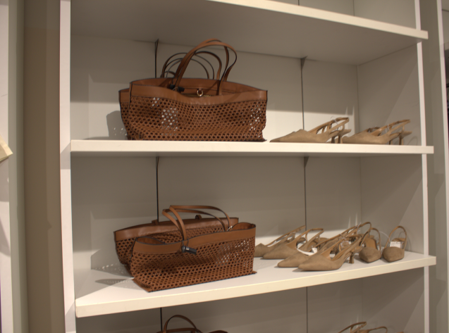
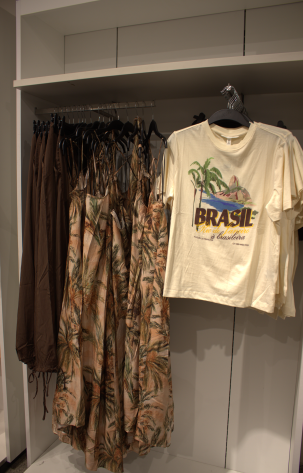

## H&M'e Gittim Ki Siz Tahmin Etmek Zorunda Kalmayın

Dürüst olalım — çevrimiçi fotoğraflar düzenlenir. Işık mükemmeldir, modeller poz vermiştir ve her şey kusursuz görünür. Peki ya parçalar *reelde askıda* nasıl görünüyor? Ve daha da önemlisi, *siz* stil yaptığınızda nasıl duruyor?

Kameramı aldım, mağazaya gittim ve gerçekten beğendiğim parçaların **10 gerçek, düzenlenmemiş fotoğrafını** çektim. Bu, H&M mağazasında şu anda alınmaya değer olan şeyler için samimi rehberiniz.

---

## Mağaza Maceram

H&M'e girdiğimde bir görevim vardı. Körfez'deki yaşam tarzımıza uygun çok yönlü parçalar bulmak istedim — nefes alabilen kumaşlar, zarif silüetler ve gündüzden geceye geçiş yapabilen ürünler.

İşte mağaza atmosferinden ve gözüme çarpan parçalardan bir kesit:


  
  
  
  
  
  
  
  
  
  


---

## Elbiseleri Doğru Aksesuarlarla Kombinlemek

Şu gerçek var — bir elbise, onu stillendirene kadar sadece bir elbisedir. Aksesuar bölümünde zarif çantalar ve ayakkabılarla farklı elbiseleri kombinlemek için zaman harcadım ve fark *inanılmazdı*.

**En sevdiğim kombin:**
- Nötr tonda akışkan bir midi elbise
- Yapılı deri görünümlü bir çanta ile
- İnce topuklu veya kalın tabanlı loafer'larla tamamlandı

Çanta anında kombinizi yükseltir ve ayakkabılar her şeyi birbirine bağlar. İnsanların "Bunu nereden aldın?" diye sorduğu türden bir görünüm.

---

## Kalite Sürprizi: Ev Giyim ve Spor Giyim

İtiraf etmeliyim — spor giyim bölümünden pek bir beklentim yoktu. Ama kumaşlara dokunup dikişleri kontrol ettikten sonra gerçekten etkilendim. Pamuk yumuşak, taytlar squat testini geçiyor (evet, kontrol ettim) ve spor sütyenleri gerçekten destek sağlıyor.

**Öne çıkanlar:**
- Körfez havası için mükemmel nefes alabilen kumaşlar
- Birden fazla yıkamaya dayanıklı sağlam dikişler
- Bütçeyi zorlamayan uygun fiyatlar
- Spor salonunda ve dışında da kullanılabilecek şık tasarımlar

İster spor salonuna gidiyor olun, ister sadece alışverişe çıkıyor olun, bu parçalar rahat, kaliteli ve gerçekten iyi görünüyor.

---

## Fotoğraflarıma Neden Güvenmelisiniz?

Bunları kendim çektim — filtre yok, profesyonel ışık yok, hile yok. Gördüğünüz şey, mağazada tam olarak bulacağınız şey. Size gerçekçi bir ön izleme sunmak istedim, böylece çevrimiçi alışverişi güvenle yapabilirsiniz.

**Odaklandığım şeyler:**
- ✨ Gerçek kumaş dokusu ve renkleri
- ✨ Parçaların askıda nasıl göründüğü
- ✨ İşe yarayan stil kombinasyonları
- ✨ Mağazanın havası ve atmosferi

---

## 🛍️ Körfez Alışverişçileri İçin Özel %5 İndirim

Alışveriş indirimle daha eğlenceli, değil mi? Sizin için özel bir **%5 indirim** kuponu hazırladım.

  
Ödeme sırasında bu kodu kullanın:

  
D8DN

  
<strong>%5 indirim</strong> için geçerlidir:

  

    <a href="https://ae.hm.com/en" target="_blank">🇦🇪 BAE</a> |
    <a href="https://sa.hm.com/en" target="_blank">🇸🇦 Suudi Arabistan</a> |
    <a href="https://bh.hm.com/en" target="_blank">🇧🇭 Bahreyn</a> |
    <a href="https://kw.hm.com/en" target="_blank">🇰🇼 Kuveyt</a>
  

---

## Son Karar: Almalı mısınız?

**Kesinlikle.** Ama sadece ne aldığınızı biliyorsanız — ve artık biliyorsunuz.

Yeni koleksiyonda gerçek mücevherler var. Kumaşlar beklediğimden daha iyi, kesimler hoş ve aksesuar oyunu güçlü. İster ihtiyacınız olsun:
- Özel bir gün için elbise
- Evden çalışma günleri için rahat ev giyimi
- Egzersizleriniz için kaliteli spor giyim
- Görünümünüzü tamamlayacak mükemmel çanta

...H&M'de var ve gerçekte daha da iyi görünüyor.

---

## Alışverişe Hazır Mısınız? İşte Harekete Geçme Çağrınız

Fotoğrafları gördünüz. Stil ipuçlarına sahipsiniz. Ve en önemlisi, **%5 indirim kuponunuz** var.

**Tahmin etmeyi bırakın ve güvenle alışverişe başlayın.**

<a href="https://ae.hm.com/en" target="_blank" class="cta-button">Hemen Alışveriş Yapın ve %5 Tasarruf Edin</a>

Ödeme sırasında **D8DN** kodunu kullanmayı unutmayın!

---

*Hangi parça dikkatinizi çekti? Bana bir mesaj bırakın — ne almayı planladığınızı duymayı çok isterim!*