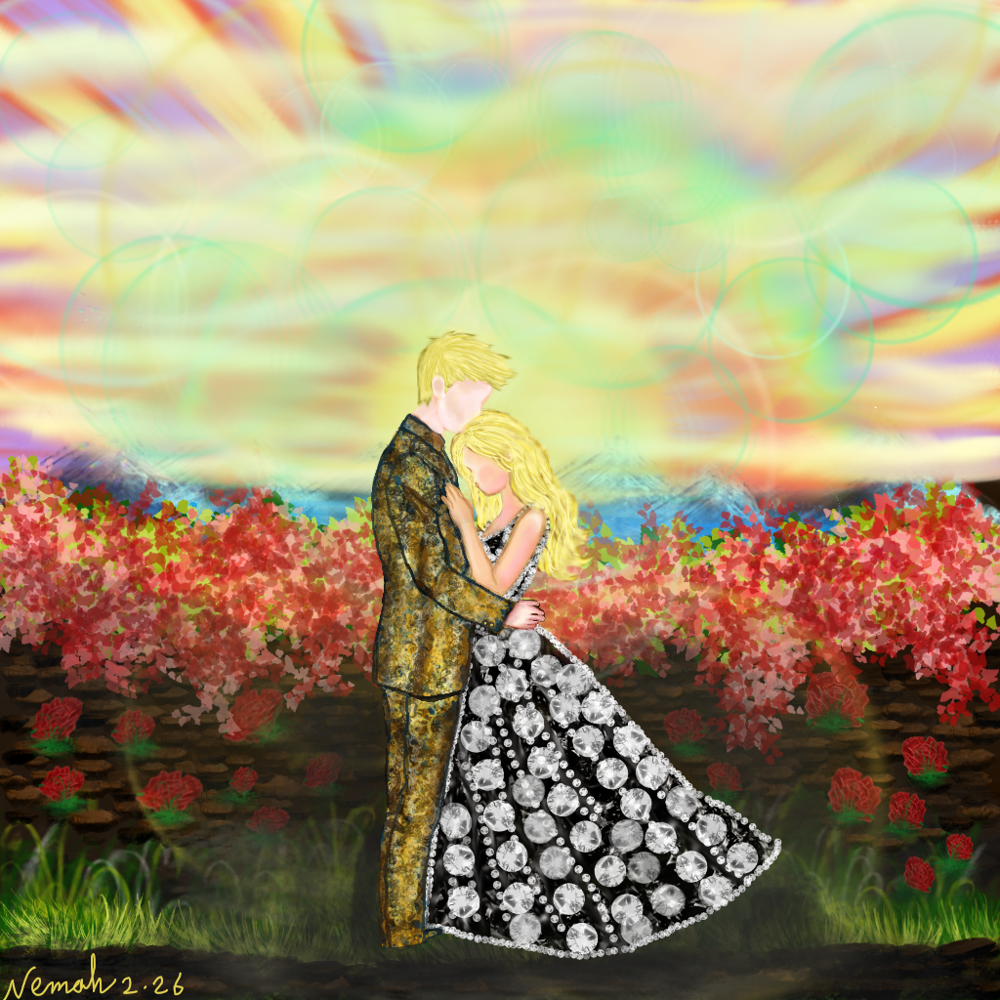

  <header class="gallery-header">
    <h1>Huzurun Ağırlığı</h1>
    
Dijital Sanat Galerisi

    
30 Temmuz 2026

  </header>

  <figure class="art-canvas">
    
    <figcaption class="art-caption">
      “Yorulduklarında, yaslanacak bir omuz bulurlar.”
      &nbsp;— Nemah
    </figcaption>
  </figure>

  

    
Dijital tuvalin kalemin baskısıyla buluştuğu anda özel bir büyü oluşur. Bu, teknoloji ile insan duyguları arasında bir danstır; her vuruş bir komut, her karışım bir nefestir. Bu eser, dinlenmenin sessiz teslimiyetini keşfediyor—dünyanın kaybolduğu ve güvenli alanını bulduğun an.

    

      <strong>✦ Vizyon ✦</strong> 
      Dalgalı sarı saçlı genç bir kadın, başını partnerinin omzuna yaslıyor. Gözleri kapalı, hüzünle değil, derin bir huzur içinde. Enerjisini yeniliyor. Güveniyor. Partneri sağlam duruyor—sıcaklığın bir sütunu.
    

    
<strong>Toprak ve Göksel</strong> — Figürleri derin kahverengiler ve sıcak toprak tonlarıyla sabitledim ki bu, istikrarı temsil etsin. Arka plan ise <strong>gökkuşağı gökyüzü</strong>—pembe, sarı, mor ve mavinin dönenceleri—Krita'nın yumuşak fırçalarıyla harmanlanmış. Bu karşıtlık, aşkın sıradan bir anı nasıl büyülü bir şeye dönüştürdüğünü simgeliyor.

    
<strong>Araçlar:</strong> Wacom tabletimi kullanarak, cilt gölgelendirmesi için basınç hassasiyetini opaklığa bağladım. Saçlar hafif, hızlı vuruşlarla oluşturuldu. Krita'nın <em>Color Dodge</em> katmanı gökyüzüne parlak bir ışıltı verdi—sanki ışık bağlantılarından yayılıyormuş gibi.

    

      
❀ Omuz ❀

      

        <em>Dünyanın yükü çok ağır geldiğinde tutmaya,</em>
        ve ruh buz gibi soğuktan bir sığınak aradığında,
        kalbin atışının bilindiği sıcaklığa dönerler,
        ve asla yalnız durmak zorunda olmadıklarını görürler.

        <em>Hüznün gölgesi günün üzerine düştüğünde,</em>
        ve neşenin renkleri uzaklara solmaya başladığında,
        kederin ardına, öyle gerçek bir gülümsemeyle bakarlar ki,
        sevgilinin getirdiği tüm ışığı görürler.

        <em>Böylece sessizlikte dinlenirler, öyle huzurlu ve derin,</em>
        bir sözün kollarında, nöbet tutan bir sevginin.
        Çünkü aşk, yorgunluğun bittiği yastıktır,
        ve huzur, bir dostun gözlerinde bulunur.
      

    

    
<strong>Son Düşünce</strong> — Bu eser, kırılganlığın bir güç olduğunun hatırlatıcısıdır. Birine yaslanmak cesaret ister, onları taşıyan kişi olmak ise zarafet. Her piksel, <em>hissettirmek</em> için konuldu—sıcaklığı, sessizliği duymayı ve o gökyüzünün renklerini solumayı.

    

      <strong>Yazılım</strong> Krita
      <strong>Donanım</strong> Wacom Tablet
      <strong>Renk Paleti</strong> #d0f0b0 · #303010 · #f0f0b0 · #f0d0b0 · #303030
    

    
✦ Bir mesajda bana söyle: Sence <em>huzur</em> nasıl bir şey? ✦

  

  <footer class="gallery-footer">
    

      Dijital Sanat
      Krita
      Wacom
      Şiir
      Aşk
    

    
© 2026 — Huzurun Ağırlığı · Galeri Sürümü

  </footer>

