

    <!-- HEADER -->
    

        ✧ İSTANBUL SEÇKİSİ
        l'occitane · en çok satanlar
    

    <h1>hatıra rehberi İstanbul mağazasından kişisel bir seçki</h1>
    

        
İstanbul'da L'Occitane'a adım attım ve kendimi bademin sıcak parıltısı, lavantanın tazeliği ve ölümsüz çiçeğin zamansız zarafetiyle çevrili buldum. Rafı, en çok satan ürünleri ve en güzel hediye setlerini fotoğrafladım — tüm bunları size bu İstanbul seçkisi olarak sunmak için.

        
Ve sizin de bu deneyimi yaşamanızı istediğim için, Suudi Arabistan, BAE ve Kuveyt'te geçerli özel bir kod <strong style="background: #ede5db; padding: 0.1rem 0.8rem; border-radius: 30px;">A162</strong> ile <strong>%10 indirim</strong> elde ettim.

    

    <!-- COUPON BANNER -->
    

        
<strong>✧ size özel</strong> · %10 indirim koduyla

        A162
        🇸🇦 🇦🇪 🇰🇼
        <a href="#" class="btn-shop" style="text-decoration: none;">seçkiyi keşfet →</a>
    

    <!-- SHELF IMAGE (first image: body care shelf) -->
    

        

            
        

        
↳ dikkatimi çeken vücut bakım rafı — krem dokular ve nazik kokular.

    

    <!-- 3 BEST SELLERS -->
    <h2>✨ en çok satan üç ürün</h2>
    

        

            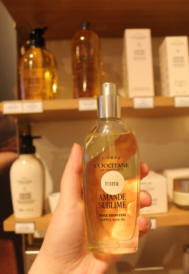
            
Amande Sublime

            
kadife vücut yağı · yumuşak ışıltı

        

        

            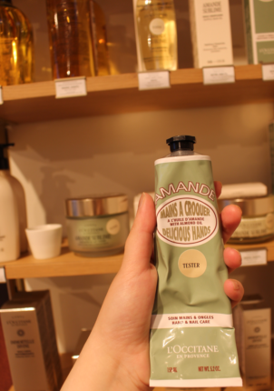
            
Amande El &amp; Tırnak

            
besleyici krem · ipeksi bitiş

        

        

            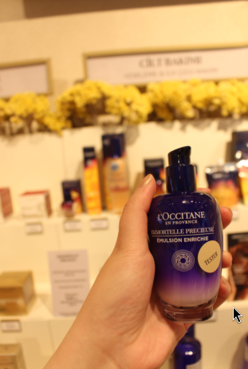
            
Immortelle Precious Emulsion

            
%97 doğal içerikli, hızlı emilen hafif sütlü losyon. Cilt daha genç, nemli ve sağlıklı görünür.

            <a href="https://ae.loccitane.com/en/face-care/immortelle-precious-emulsion/27SE075I22.html" class="product-link" target="_blank">hemen al →</a>
        

    

    <!-- PERFUME SECTION -->
    <h2>🌸 parfümler &amp; zarif kokular</h2>
    
Provence'da bir bahçe gibi kokanları seçtiğimden emin oldum. <strong>Lavande Blanche</strong> (yumuşak, sakinleştirici beyaz lavanta), <strong>Ortie Blanche</strong> (yeşil ve canlı) ve <strong>Glycine</strong> (narin wisteria).

    

        

            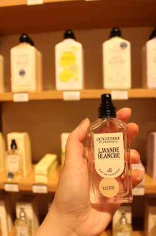
            
Lavande Blanche

            
beyaz lavanta · taze &amp; sakinleştirici

            <a href="https://ae.loccitane.com/en/all-fragrances/lavande-blanche-%28white-lavender%29-eau-de-toilette/15ET050LBR25.html" class="product-link" target="_blank">hemen al →</a>
        

        

            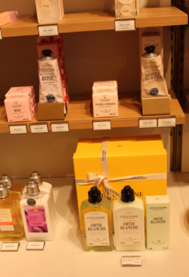
            
Ortie Blanche

            
beyaz ısırgan · parlak &amp; yeşil

            <a href="https://ae.loccitane.com/en/fragrances-and-home/ortie-blanche-%28formerly-herbae%29-eau-de-parfum/11EP050HR25.html" class="product-link" target="_blank">hemen al →</a>
        

        

            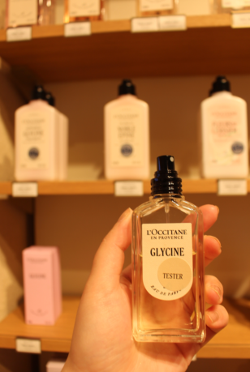
            
Glycine

            
wisteria · çiçeksi &amp; narin

            <a href="https://ae.loccitane.com/en/all-fragrances/glycine-eau-de-parfum/11EP050GYR25.html" class="product-link" target="_blank">hemen al →</a>
        

        

            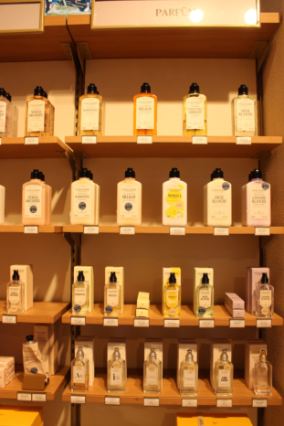
            
parfüm önizleme

            
tüm koleksiyon

        

    

    <!-- SKINCARE LINES -->
    <h2>🌿 cilt bakım hikayeleri</h2>
    

        

            
immortelle koleksiyonu

            

                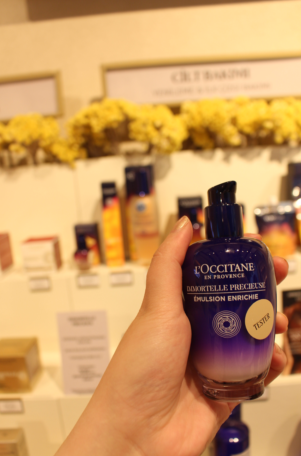
                <a href="https://ae.loccitane.com/en/face-care/immortelle-precious-emulsion/27SE075I22.html" style="display: inline-block; padding: 0.3rem 1.2rem; background: #b48b5a; color: #fffcf9; border-radius: 30px; text-decoration: none; font-size: 0.8rem; margin: 0.5rem 0 0.5rem 0.5rem;">hemen al →</a>
            

            

                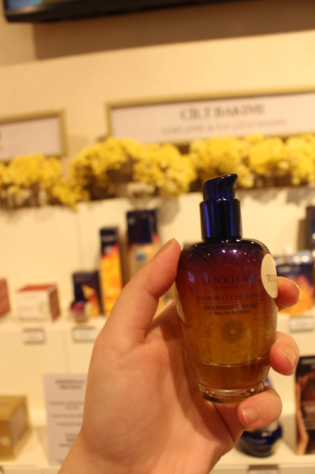
                <a href="https://ae.loccitane.com/en/face-care/immortelle-overnight-reset-serum/27OR030I24.html" style="display: inline-block; padding: 0.3rem 1.2rem; background: #b48b5a; color: #fffcf9; border-radius: 30px; text-decoration: none; font-size: 0.8rem; margin: 0.5rem 0 0.5rem 0.5rem;">hemen al →</a>
            

            

                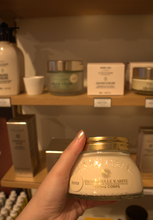
                <a href="https://ae.loccitane.com/en/face-care/immortelle-shea-neck-cream/01NC050I23.html" style="display: inline-block; padding: 0.3rem 1.2rem; background: #b48b5a; color: #fffcf9; border-radius: 30px; text-decoration: none; font-size: 0.8rem; margin: 0.5rem 0 0.5rem 0.5rem;">hemen al →</a>
            

        

        

            
olgun &amp; genel cilt için

            
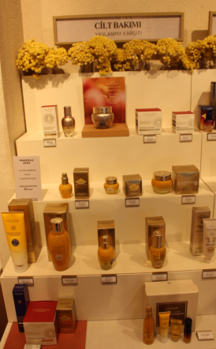

            
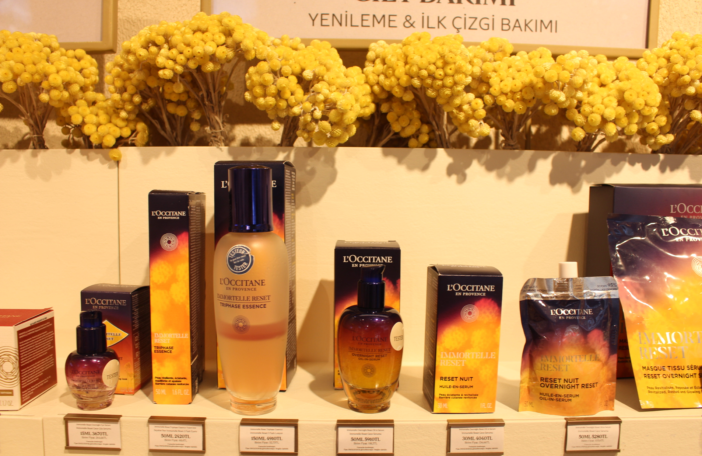

            
ilk ince çizgiden günlük neme kadar, her formül bir kadının hikayesini anlatır.

        

    

    <!-- DEEPER STORIES -->
    

    <h2 style="margin-top: 1rem;">✧ kokuların ardındaki hikayeler</h2>
    

        

            🌰
            <h3 style="margin-top: 0.2rem;">Amande · badem ritüeli</h3>
            
<strong>Amande Sublime</strong> yağı ve <strong>El &amp; Tırnak</strong> kremi sadece cilt bakımı değil — günlük bir ritüel. Badem sütü ve vanilya kokusu sizi sıcaklıkla sararken, formül cildi inanılmaz derecede yumuşak bırakır. İstanbul'da en çok satanlar olmalarına şaşmamalı.

            
↳ kuru ciltler, kış ayları veya sadece kendinize ayırdığınız bir an için ideal.

        

        

            🌸
            <h3 style="margin-top: 0.2rem;">Immortelle · altın çiçek</h3>
            
"Ölümsüz" çiçek olarak bilinen immortelle, L'Occitane'in yaşlanma karşıtı uzmanlığının kalbinde yer alır. <strong>Divine Cream</strong> sıkılaştırıcı konsantre, <strong>Precious Emulsion</strong> ve <strong>Overnight Reset Serum</strong> cildi gençleştirmek için çalışır. Bu, bir kavanozda Korsika güneşi gibidir.

            
↳ görünür sıkılık, ışıltı ve nem arayanlar için ideal.

        

    

    <!-- PERFUME STORY -->
    

        
<strong>💐 parfümler üzerine bir not</strong>

        
Parfüm tezgahında oldukça vakit geçirdim — <strong>Lavande Blanche</strong> en sakinleştirici beyaz lavanta, <strong>Ortie Blanche</strong> canlı, yeşil bir sürpriz ve <strong>Glycine</strong> narin, çiçeksi ve tamamen feminen. Birlikte, bir Provence bahçesinin ruhunu yakalıyorlar.

    

    <!-- FAQ -->
    

    <h2>❓ hızlı cevaplar · kolay alışveriş</h2>
    

        

            
A162 kupon kodunu nasıl kullanırım?

            
L'Occitane web sitesinde ödeme aşamasında <strong>A162</strong> kodunu girmeniz yeterlidir (Suudi Arabistan, BAE ve Kuveyt için geçerlidir). %10 indirim tüm siparişinize uygulanacaktır.

        

        

            
Bu kod tüm ürünler için geçerli mi?

            
Evet! %10 indirim, cilt bakımından parfümlere ve hediye setlerine kadar tüm L'Occitane ürün yelpazesi için geçerlidir. Minimum satın alma şartı yoktur.

        

        

            
Kod ne kadar süre geçerli?

            
Kod sınırlı bir süre için geçerlidir — bu nedenle en kısa sürede kullanmanızı öneririm. Süresi dolarsa bu gönderiyi güncellerim, ancak şu an aktiftir.

        

        

            
Diğer kampanyalarla birleştirebilir miyim?

            
Bu kod diğer promosyonlarla birleştirilemez, ancak ücretsiz kargo ile (varsa) birlikte kullanılabilir.

        

    

    <!-- FINAL CTA -->
    

        
✨ İstanbul hatıranız sizi bekliyor

        
Bu hazineleri keşfetmeyi çok sevdim ve umarım siz de seversiniz. O büyülü atmosferden bir parçayı eve getirmek için aşağıdaki kodu kullanın.

        

            A162
            %10 indirim · SA, BAE, KW
        

        <a href="#" class="btn-shop" style="background: #b48b5a; color: #1e1613; font-weight: 500; padding: 0.8rem 3.5rem; font-size: 1.2rem; text-decoration: none; box-shadow: 0 4px 12px rgba(180, 139, 90, 0.3);">İstanbul seçkisini keşfet →</a>
        
kod sınırlı süre geçerli · keyifli alışverişler!

    

    <!-- FOOTER -->
    

        ✧ İstanbul'dan sevgiyle hazırlandı ✧ 
        fotoğraflar &amp; anılar · L'Occitane en çok satanlar · <strong>A162</strong> koduyla %10 indirim
        
🇸🇦 🇦🇪 🇰🇼 · sadece okuyucularım için özel

    

